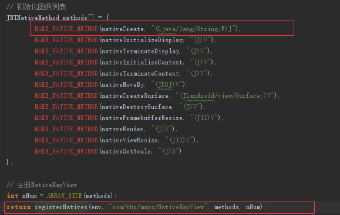
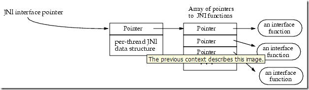

#JNI使用总结

JNI是Java Native Interface的缩写，它提供了若干的API实现了Java和其他语言的通信（主要是C&C++）。JNI是java平台
的一部分，本文介绍Android的JNI的使用。JNI技术解决了其他语言和java的通信问题，其优点是可以使用已经存在的其他
语言的功能模块，也可以将一些对性能有特别要求的功能用C&C++实现。其缺点是引入JNI技术后的java程序将不再有跨平台
特性。

##名词解释

* JNI(Java Native Interface):意为Java本地调用，它允许Java代码和其他语言写的代码进行交互，简单的说，一种
 在Java虚拟机控制下执行代码的标准机制。
* NDK(Native Development Kit):是一套工具集合，允许你用C/C++语言实现程序的一部分。

###JNI和NDK的区别

从工具上说，NDK其实多了一个把.so和.apk打包的工具。而JNI必能没有打包功能，它只是把.so文件放到文件系统的特定
位置。

从编译库说，NDK开发C/C++只能使用NDK自带的有限的头文件,而使用JNI则可以使用文件系统中带的头文件。

从编写方式说，他们一样。

##使用方式

swig工具此次未使用，不做对比。远程的方式流程清晰，但是产生的代码函数名字很长，代码美观度很差。编码
方式封装结构自己可以控制，可以提高代码美观度而且不用使用命令行工具生成头文件，但技术难度相对较高。Mapbox使用的
就是编码方式实现的JNI层。

###swig工具

略。在网上可以找到相关使用教程 [教程](http://www.ibm.com/developerworks/cn/aix/library/au-swig/)。

###原生方式

* step 1：编写java类使用native声明本地方法
 

* step 2：使用javah命令用“step 1”编写的java类生成.h文件
 

 

 

* step 3：实现“step 2”生成的.h文件的本地方法并编译成本地库
 

 
* step 4：将“step 3”产生的本地库放到java类可以找到的位置
 

 也可以设置环境变量或将库拷贝的已有的环境变量下。

* step 5：运行java程序验证本地方法；
 

###编码方式

* step 1：编写java类，在java类中声明本地函数。
 
* 在JNI_OnLoad注册函数
 
 
 

####下面以一个具体的函数为例进行说明：

在Java类NativeMapView有如下本地函数声明

	private native long nativeCreate(String apkPath, float pixelRatio);

自编码实现如下函数(C函数)

	jlong nativeCreate(JNIEnv * env, jobject obj,jstring apkPath, jfloat pixelRatio);

	jlong nativeCreate(JNIEnv *env, jobject obj,jstring apkPath, jfloat pixelRatio)
	{
		LOGD("JNI", "nativeCreate");

		std::string apkPath_ = std_string_from_jstring(env, &apkPath);
		return reinterpret_cast<jlong>(new NativeMapView(env, obj, pixelRatio));
	}

在JNI_OnLoad()函数中将C函数装入结构体中，并调用JNI的注册函数进行函数注册：

注册函数的代码如下：

	jint registerNatives(JNIEnv * env, const char * szClazz, const JNINativeMethod* methods, jint nNums)
	{
		jclass clazz;
		clazz = env->FindClass(szClazz);

		if (clazz == NULL) {
			std::stringstream ss;
			ss << "Native registration unable to find class " << szClazz << std::endl;
			LOGE("", ss.str().c_str());
			return -1;
		}

		if (env->RegisterNatives(clazz, methods, nNums) < 0) {
			std::stringstream ss;
			ss << "RegisterNatives failed for " << szClazz << std::endl;
			LOGE("", ss.str().c_str());
			return -1;
		}

		return  0;
	}

注意"(Ljava/lang/String;F)J"表示C函数的参数列表和返回值，括号里的"Ljava/lang/String;"表示字符串,F表示单精度浮点数，括号外的"J"表示
返回值是长整形。这些表示专有名词为域描述符：

域描述符

| 域 | Java 语言 |
|:---: |:---: |															
|Z	|boolean|
|B	|byte|
|C	|char|
|S	|short|
|I	|int|
|J	|long|
|F	|float|
|D	|double|

另外，应用类型为L+该类型类描述符+。
数组，其为：[+其类型的域描述符+。
多维数组则是n个[+该类型的域描述符，n代表的是几维数组。

String类型的域描述符为 Ljava/lang/String;
[+ 其类型的域描述符 + ;

|类型|描述符|
|:---|:---|
|int[]|[I | 
|float[]|[F | 
|String[]|[Ljava/lang/String; | 
|Object[]|[Ljava/lang/Object; | 
|int[][]|[[LI | 
|float[][]|[[LF | 

##JNI库调试

使用Android Studio(Version 2.2.2）可以调试JNI库，调试方法和调试Android Studio调试java代码一样。但是如果JNI库引入其他C++库的话，这个被JNI库引用的库
是不能调试的。

##JNI原理

此前的章节简要介绍了JNI的作用的实战方面的知识，下面JNI的原理和细节。下面的JNI原理图来自官网。

 

###JNIEnv与JavaVM

* JNIEnv：是一个线程相关的结构体，该结构代表了Java在本线程的运行环境。
* JavaVM：Java虚拟机在JNI层的代表，JNI全局只有一个。

JNIEnv是JavaVM在线程中的代表，每个线程都有一个J，JNI中可能有很多个JNIEnv。

JNIEnv作用：
* 调用Java函数：JNIEnv代表Java运行环境，可以使用JNIEnv调用Java中的代码。
* 操作Java对象：Java对象传入JNI层就是 jobject，需要用JNIEnv来操作这个Java对象。

####JNIEnv体系结构

* 线程相关，不能跨线程，JNIEnv只有在当前线程有效，JNIEnv不能在线程间传递，在同一个线程中，多次
调用JNI层方法，传入的JNIEnv是相同的；
* 本地方法匹配多JNIEnv：在Java层定义的本地方法，可以在不同的线程调用，因此可以接受不同的JNIEnv。

JNIEnv结构：JNIEnv是一个指针，指向线程相关的结构，线程相关的结构指向JNI函数指针数组，这个数组中存放了大量的
JNI函数指针，这些指针指向了具体的JNI函数。

###UTF-8编码
JNI使用改进的UTF-8字符串来表示不同的字符类型。Java使用UTF-16编码。UTF-8编码主要用于C语言，inwei他的编码用\u000
表示0xc0而不是通常的0xx。非空ASCII字符改进后的字符串中可以用一个字节表示。

JNI不会检查NullPointerException、illegalArgumentException这样的错误，原因是导致性能下降。

在绝大多数C的库函数中，很难避免错误发生。
JNI允许用户使用Java的异常处理。大部分JNI方法会返回错误代码但本身并不会报出异常。因此，很有必要在代码本身进行处理，降异常
抛给Java。在JNI内部，首先会检查调用函数返回的错误代码，之后会调用ExpectOccurred()返回一个错误对象。

###JNI_OnLoad()与JNI_OnUnload()
当Android的VM(Virtual Machine)执行到System.loadLibary()函数时，首先回去执行C组件里的JNI_OnLoad()函数。它的用途有二：
* 告诉VM此C组件使用那个JNI版本，如果你的*.so没有提供JNI_OnLoad()函数，VM会默认*.so是使用最老版本的JNI1.1版本。由于
新版JNI做了许多扩充，如果需要使用JNI的新版本功能就必须有JNI_OnLoad()函数来告知VM。
* 由于VM执行System.loadLibrary()函数时，就会立即先呼叫JNI_OnLoad(),所以C组件可以在JNI_OnLoad()函数中进行必要的初始化
工作。

###原始数据

jobject对象引用类型

|Java类型|本地类型（JNI）|描述|
|:---|:---:|:---|
|boolean（布尔型）|	jboolean		|无符号8个比特|
|byte(字节型)|	jbyte		|有符号8个比特|
|char(字符型)|	jchar		|无符号16个比特|
|short(短整型)|	jshort		|有符号16个比特|
|int(整型)|	jint		|有符号32个比特|
|long(长整型)|	jlong		|有符号64个比特|
|float(浮点型)|	jfloat|		32个比特|
|double(双精度浮点型)	|jdouble		|64个比特|
|void(空型)|	void		|N/A|

|函数	 				|Java 数组类型		|	本地类型						|	说明|
|:---|:---|:---|:---:|
|GetBooleanArrayElements|	jbooleanArray|	jboolean|	ReleaseBooleanArrayElements 释放|
|GetByteArrayElements	|jbyteArray	|jbyte	|ReleaseByteArrayElements 释放|
|GetCharArrayElements	|jcharArray	|jchar	|ReleaseShortArrayElements 释放|
|GetShortArrayElements	|jshortArray	|jshort	|ReleaseBooleanArrayElements 释放|
|GetIntArrayElements	|jintArray	|jint	|ReleaseIntArrayElements 释放|
|GetLongArrayElements	|jlongArray	|jlong	|ReleaseLongArrayElements 释放|
|GetFloatArrayElements	|jfloatArray	|jfloat	|ReleaseFloatArrayElements 释放|
|GetDoubleArrayElements	|jdoubleArray	|jdouble	|ReleaseDoubleArrayElements 释放|
|GetObjectArrayElement	|自定义对象	|object	| | 
|SetObjectArrayElement	|自定义对象	|object	| |
|GetArrayLength	 	 	|||获取数组大小|
|New<Type>Array	 	 	|||创建一个指定长度的原始数据类型的数组|
|GetPrimitiveArrayCritical	 	 	|||得到指向原始数据类型内容的指针，该方法可能使垃圾回收不能执行，该方法可能返回数组的拷贝，因此必须释放此资源。|
|ReleasePrimitiveArrayCritical	 	 	|||释放指向原始数据类型内容的指针，该方法可能使垃圾回收不能执行，该方法可能返回数组的拷贝，因此必须释放此资源。|
|NewStringUTF	 	 	|||jstring类型的方法转换|
|GetStringUTFChars	 	 	|||jstring类型的方法转换|
|DefineClass 	 	 	|||从原始类数据的缓冲区中加载类|
|FindClass 	 	 	|||该函数用于加载本地定义的类。它将搜索由CLASSPATH 环境变量为具有指定名称的类所指定的目录和 zip文件|
|GetObjectClass 	 	 	|||通过对象获取这个类。该函数比较简单，唯一注意的是对象不能为NULL，否则获取的class肯定返回也为NULL|
|GetSuperclass 	 	 	|||获取父类或者说超类 。 如果 clazz 代表类class而非类 object，则该函数返回由 clazz 所指定的类的超类。 如果 clazz指定类 object 或代表某个接口，则该函数返回NULL|
|IsAssignableFrom 	 	 	|||确定 clazz1 的对象是否可安全地强制转换为clazz2|
|Throw	 	 	|||抛出 java.lang.Throwable 对象|
|ThrowNew 	 	 	|||利用指定类的消息（由 message 指定）构造异常对象并抛出该异常|
|ExceptionOccurred 	 	 	|||确定是否某个异常正被抛出。在平台相关代码调用 ExceptionClear() 或 Java 代码处理该异常前，异常将始终保持抛出状态|
|ExceptionDescribe 	 	 	|||将异常及堆栈的回溯输出到系统错误报告信道（例如 stderr）。该例程可便利调试操作|
|ExceptionClear 	 	 	|||清除当前抛出的任何异常。如果当前无异常，则此例程不产生任何效果|
|FatalError 	 	 	|||抛出致命错误并且不希望虚拟机进行修复。该函数无返回值|
|NewGlobalRef 	 	 	|||创建 obj 参数所引用对象的新全局引用。obj 参数既可以是全局引用，也可以是局部引用。全局引用通过调用DeleteGlobalRef() 来显式撤消。|
|DeleteGlobalRef 	 	 	|||删除 globalRef 所指向的全局引用|
|DeleteLocalRef 	 	 	|||删除 localRef所指向的局部引用|
|AllocObject 	 	 	|||分配新 Java 对象而不调用该对象的任何构造函数。返回该对象的引用。clazz 参数务必不要引用数组类。|
|getObjectClass	 	 	|||返回对象的类|
|IsSameObject	 	 	|||测试两个引用是否引用同一 Java 对象|
|NewString 	 	 	|||利用 Unicode 字符数组构造新的 java.lang.String 对象|
|GetStringLength 	 	 	|||返回 Java 字符串的长度（Unicode 字符数）|
|GetStringChars 	 	 	|||返回指向字符串的 Unicode 字符数组的指针。该指针在调用 ReleaseStringchars() 前一直有效|
|ReleaseStringChars 	 	 	|||通知虚拟机平台相关代码无需再访问 chars。参数chars 是一个指针，可通过 GetStringChars() 从 string 获得|
|NewStringUTF 	 	 	|||利用 UTF-8 字符数组构造新 java.lang.String 对象|
|GetStringUTFLength 	 	 	|||以字节为单位返回字符串的 UTF-8 长度|
|GetStringUTFChars 	 	 	|||返回指向字符串的 UTF-8 字符数组的指针。该数组在被ReleaseStringUTFChars() 释放前将一直有效|
|ReleaseStringUTFChars 	 	 	|||通知虚拟机平台相关代码无需再访问 utf。utf 参数是一个指针，可利用 GetStringUTFChars() 获得|
|NewObjectArray 	 	 	|||构造新的数组，它将保存类 elementClass 中的对象。所有元素初始值均设为 initialElement|
|Set<PrimitiveType>ArrayRegion	 	 	|||将基本类型数组的某一区域从缓冲区中复制回来的一组函数|
|GetFieldID 	 	 	|||返回类的实例（非静态）域的属性 ID。该域由其名称及签名指定。访问器函数的|
|Get<type>Field |||及 Set<type>Field系列使用域 ID 检索对象域。GetFieldID() 不能用于获取数组的长度域。应使用GetArrayLength()。|
|Get<type>Field	 	 	|||该访问器例程系列返回对象的实例（非静态）域的值。要访问的域由通过调用GetFieldID() 而得到的域 ID 指定。 |
|Set<type>Field	 	 	|||该访问器例程系列设置对象的实例（非静态）属性的值。要访问的属性由通过调用 SetFieldID() 而得到的属性 ID指定。
|GetStaticFieldID|||静态属性.| 
|GetStatic<type>Field|||同上,只不过是静态属性。|
|SetStatic<type>Field|||同上,只不过是静态属性。|
|GetMethodID	 	 	|||返回类或接口实例（非静态）方法的方法 ID。方法可在某个 clazz 的超类中定义，也可从 clazz 继承。该方法由其名称和签名决定。 GetMethodID() 可使未初始化的类初始化。要获得构造函数的方法 ID，应将<init> 作为方法名，同时将void (V) 作为返回类型。|
|CallVoidMethod	 	 	|||| 
|CallObjectMethod	 	 	|||| 
|CallBooleanMethod 	 	 	|||| 
|CallByteMethod	 	 	|||| 
|CallCharMethod	 	 	|||| 
|CallShortMethod	 	 	|||| 
|CallIntMethod	 	 	|||| 
|CallLongMethod	 	 	|||| 
|CallFloatMethod	 	 	|||| 
|CallDoubleMethod	 	 	|||| 
|GetStaticMethodID 	 	 	|||调用静态方法|
|Call<type>Method	 	 	|||| 
|RegisterNatives 	 	 	|||向 clazz 参数指定的类注册本地方法。methods 参数将指定 JNINativeMethod 结构的数组，其中包含本地方法的名称、签名和函数指针。nMethods 参数将指定数组中的本地方法数。|
|UnregisterNatives 	 	 	|||取消注册类的本地方法。类将返回到链接或注册了本地方法函数前的状态。该函数不应在常规平台相关代码中使用。相反，它可以为某些程序提供一种重新加载和重新链接本地库的途径。  |
