#TileStache部署
[TileStache](http://tilestache.org/)是python写的可以产生切片开源服务程序。[TileStache](http://tilestache.org/)的部署比较复杂，而且网上没有一篇相对全面的
文章，所以在这里整理TileStache的部署文档以供以后查阅。

##依赖项
1. [swig](http://www.swig.org/),必须,全称是Simplified Wrapper and Interface Generator，一个可以将C/C++绑定为其他高级语言的开源工具。
2. [gdal](http://www.gdal.org/),必须, python开发包（需要gdal的核心库，也就是gdal的c++库）,鉴于此库在GIS行业内的权威性和广泛性所以不对此库做进一步介绍。
3. [PIL](https://pypi.python.org/pypi/Pillow/3.2.0#downloads),必须,Pillow is the friendly PIL fork by Alex Clark and Contributors. PIL is the Python Imaging Library by Fredrik Lundh and Contributors. 就是一个Python的图片库。
4. [ModestMaps](http://modestmaps.com),必须,一个为那些希望在自己的工程中使用交互地图的开发者和设计者提供的一个小型的、可扩展的开源库。它使用一组外挂钩子程序提供紧凑的、干净的核心功能。
5. [Werkzeug](http://werkzeug.pocoo.org/),可选,Werkzeug is a WSGI utility library for Python. It's widely used and BSD licensed.应该是一个通讯库。
6. [Simplejson](https://github.com/simplejson/simplejson),可选,编码和解码json的python库。
7. [Mapnik](http://mapnik.org),可选,符号引擎库。

##swig安装
下载安装Swig的时候注意下载Swigwin（我下的是swigwin-3.0.8.zip），不要下载源代码，否则不能在windwos下用。下载后解压，将swigwin-3.0.8的解压目录添
加到环境变量Path中去，否则会出现一些关于配置文件的麻烦。检验swig是否成功设置到环境变量Path中的最简单的方式就是在运行中输入swig后回车，如果提
示windows找不到swig，那么说明没有设置成功；如果出现一个黑屏一闪而过，或者提示需要options的选项就说明成功了。

* 压缩包内容
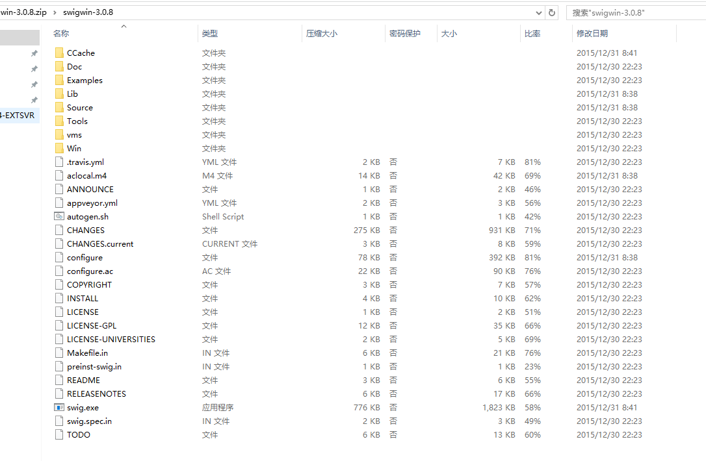

* 验证命令   
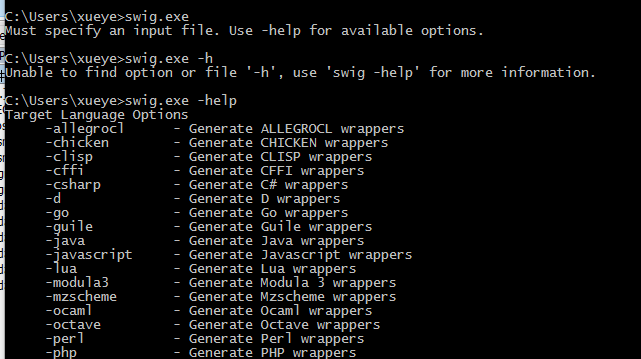

##编译gdal库
因为直接使用安装包没有成功，只能通过自己编译gdal的方式安装gdal的核心库和python开发包。

###gdal核心库编译
gdal库的全部编译是很复杂的，好在我们只是用gdal的主要功能，所以不用过多的关注gdal的编译技巧，只要使用默认的makefile用vc的命令行编译方式进行编译就好了。
一篇介绍gdal编译的帖子：http://www.cnblogs.com/bigbigtree/archive/2011/11/20/2256434.html

####使用cmd命令行编译

使用cmd命令行编译，首先在“开始菜单\所有程序\Microsoft Visual Studio 2008\Visual Studio Tools\ Visual Studio 2008命令提示”，点击“Visual Studio 2008 命令提示”会弹出下面的界面：
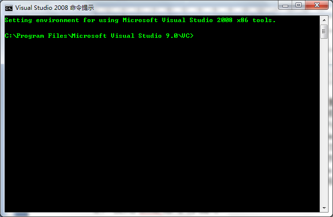

然后使用cd命令切换到GDAL源代码目录：
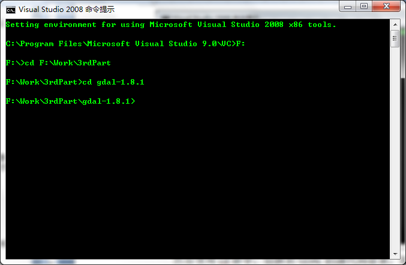

依次敲入以下命令回车，等待编译结束即可
nmake -f makefile.vc

nmake -f makefile.vc install

nmake -f makefile.vc devinstall

同时还有其他的命令，如：

nmake -f makefile.vc clean

nmake -f makefile.vc MSVC_VER=1400clean

nmake -f makefile.vc MSVC_VER=1400DEBUG=1

上面六行的命令含义依次是：

编译GDAL库

编译GDAL库，并安装（这里安装的意思就是将生成的dll，exe等文件拷贝到系统可以找到目录，系统目录或者配置到环境变量中的目录）

编译GDAL库，并安装开发者模式（安装的意思同上，开发者模式意思是将开发用的include文件夹中的头文件和lib文件一同拷贝到安装目录，
此时会在安装目录中多出来两个文件夹，分别是include和lib，分别存放的是GDAL的头文件和lib文件，用于调用GDAL库使用）。

清理GDAL库，同时会删除编译GDAL库所生成的临时文件，作用相当于在VS环境中的清理命令。

作用同上，但是添加了一个MSVC_VER=1400，表示使用VS2005编译。

编译GDAL库的debug模式，可以用来调试GDAL源码。

例如：我本机的GDAL的安装目录为D:/GDAl:
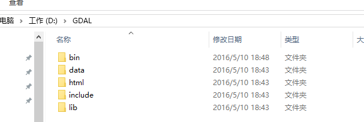

因为我的安装目录不是系统目录，所以需要将安装目录下的bin目录设置到环境变量中，如下图：
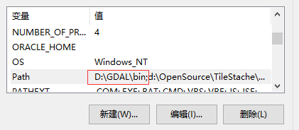

###gdal python版本的编译
首先，修改GDAL源代码根目录下nmake.opt文件，找到如下：

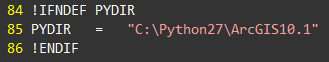

将后面的路径修改为python的安装路径后保存，我本机安装目录和上图一致。

然后，使用cd命令禁图gdal源代码目录下swig/python目录，一次输入：

	python setup.py build
	python setup.py install

执行完上述命令后，会在python的lib/site-packages目录下看到GDAL-2.1.0-py2.7-win32.egg目录。

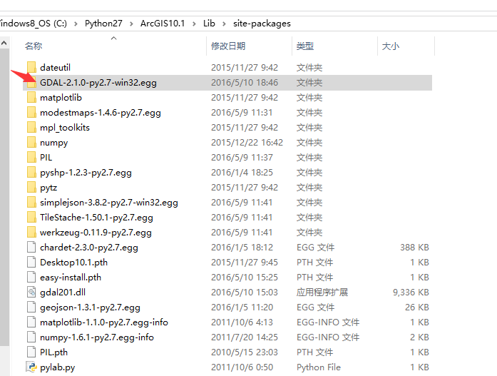

###验证
安装了GDAL的核心库和python开发包后，可以使用python脚本测GDAL核心库和python开发包是否安装成功；
	
	from osgeo import gdal  
	from osgeo.gdalconst import *  
	dataset=gdal.Open("F:\Work\Data\envi.img",GA_ReadOnly)  
	dataset.GetDriver().ShortName  
	#'ENVI' #图像格式  
	dataset.GetProjectionRef()  
	#'PROJCS["unnamed",GEOGCS["NAD83",DATUM["North_American_Datum_1983",SPHEROID["GRS 1980",6378137,298.257222101,AUTHORITY["EPSG","7019"]],TOWGS84[0,0,0,0,0,0,0],AUTHORITY["EPSG","6269"]],PRIMEM["Greenwich",0,AUTHORITY["EPSG","8901"]],UNIT["degree",0.0174532925199433,AUTHORITY["EPSG","9108"]],AUTHORITY["EPSG","4269"]],PROJECTION["Transverse_Mercator"],PARAMETER["latitude_of_origin",30],PARAMETER["central_meridian",-84.16666666666667],PARAMETER["scale_factor",0.9999],PARAMETER["false_easting",2296587.926509186],PARAMETER["false_northing",0],UNIT["Foot (International)",0.3048]]' #图像投影信息  

也可以直接在控制台敲入命令验证安装成功与否，如下图：
	
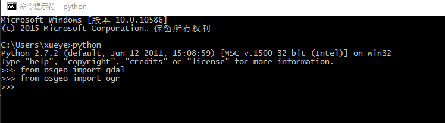

 *参考文档：http://blog.csdn.net/liminlu0314/article/details/7310651*

##[PIL](http://www.pythonware.com/products/pil)安装

简单了解一下该库，如下是英文说明：

>The Python Imaging Library (PIL) adds image processing capabilities to your Python interpreter. This library supports many file formats, and provides powerful image processing and graphics capabilities.

翻译为中文的一起就是这是一个有处理图像能力的Python库，支持多种格式，并且提供高效的图像处理和绘图功能。
因为TileStache只是用到了这个库，所以我们只要安装到Python环境中就可以了，不对该库做进一步的展开介绍。

在 https://pypi.python.org/pypi/Pillow/3.2.0#downloads 找到自己的安装包直接安装，如下:
	
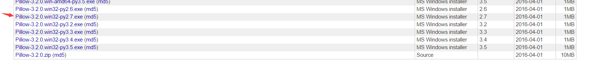

**双击下载的exe文件进行安装就可以了。**

##[Werkzeug](http://werkzeug.pocoo.org/)安装
简单了解一下该库，如下是该库的英文描述：
>Werkzeug is a WSGI utility library for Python. It's widely used and BSD licensed.

我的理解是该库使用个Python的通讯库，因为只是在安装TileStache时用到，所以不对该库进行展开介绍。

通过git命令行工具执行如下命令：
>git clone git@github.com:mitsuhiko/werkzeug.git

如下图：
>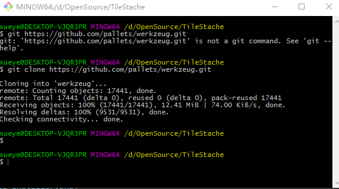

然后进入下载的源码目录下执行命令**python setup.py install**,另外需要说明一下，虽然TileStache官网说对werkzeug库的依赖是可选性的，但是没有该库TileStache无法安装成功。

##[Simplejson](https://github.com/simplejson/simplejson)安装
这个库是对json编码、解码的Python库。

安装步骤和[Werkzeug](http://werkzeug.pocoo.org/)库的安装方法类似。

1. 通过git命令工具执行
>git clone https://github.com/simplejson/simplejson.git,如下图:
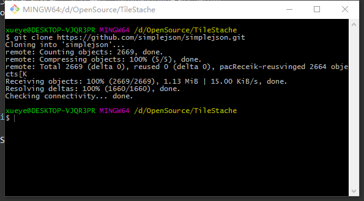

2. 进入下载的源代码目录执行命令**python setup.py install**, 和[Werkzeug](http://werkzeug.pocoo.org)库一样，[Simplejson](https://github.com/simplejson/simplejson)也是
可选库，但是没有该库TileStache无法安装成功。安装过程如下图：
>

##[ModestMaps](http://modestmaps.com)安装
简单了解一下该库，如下是该库的英文描述：
>Modest Maps is a small, extensible, and free library for designers and developers who want to use interactive maps in their own projects. It provides a core set of features in a tight, clean package with plenty of hooks for additional functionality.d

翻译:
ModestMaps是一个为那些希望在自己的工程中使用交互地图的开发者和设计者提供的一个小型的、可扩展的开源库。它使用一组外挂钩子程序提供紧凑的、干净的核心功能。

安装步骤和[Werkzeug](http://werkzeug.pocoo.org/)库的安装方法类似。

1. 通过git命令工具执行
>git clone https://github.com/stamen/modestmaps-py.git,这里要注意一点TileStache给出的modestmaps的代码仓库地址(http://github.com/migurski/modestmaps-py)是早期
版本，我们使用TileStache1.50.1版本需要1.30以上版本的[ModestMaps](http://modestmaps.com)。获取源代码过程如下图:

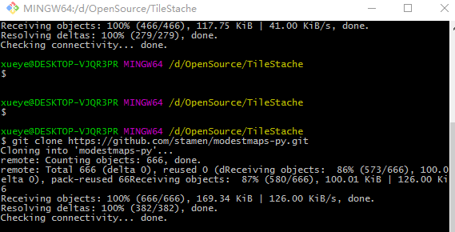

2. 进入下载的源代码目录执行命令**python setup.py install**进行安装。

##[Mapnik](http://mapnik.org/)
符号渲染引擎，不用这个库也是可以安装TileStache库的，所以不介绍该库的安装。

##[TileStache](http://tilestache.org/)安装
前边的依赖库都安装好了，就可以安装[TileStache](http://tilestache.org/)了，安装过程和[Werkzeug](http://werkzeug.pocoo.org/)库安装方法类似。

1. 通过git命令工具执行
>git clone https://github.com/TileStache/TileStache.git,获取源代码。

2. 进入下载的源代码目录执行命令**python setup.py install**进行安装,如下图：
>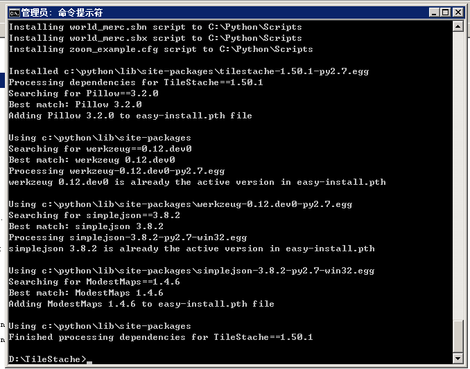

#[TileStache](http://tilestache.org)使用
[TileStache](http://tilestache.org)可以切瓦片也可以对外发布地图切片服务，因为只需要切片的功能，所以只介绍生产切片的方法。

首先要修改修改TileStache的配置文件,TileStache的根目录下找到名为tilestache.cfg的配置文件，然后拷贝到你认为合理的地方（
只要TileStache的命令脚本可以找到就可以，我的放在执行脚本的同级目录下）

	{
	"cache":
	{
		"name": "Test",
		"path": "/tmp/stache",
		"umask": "0000"
	},
	"layers": 
	{
		"osm":
		{
		"provider": {"name": "proxy", "provider": "OPENSTREETMAP"},
		"png options": {"palette": "http://tilestache.org/example-palette-openstreetmap-mapnik.act"}
		},
		"example":
		{
		"provider": {"name": "mapnik", "mapfile": "examples/style.xml"},
		"projection": "spherical mercator"
		} 
	}
	}

修改缓存类型和文件目录，添加要切片的矢量数据文件,修改后内容如下：

	{
	"cache":
	{
		"name": "Disk",
		"path": "file://D:/stache",
		"umask": "0000",
		"dirs":"portable"
	},
	"layers": 
	{
		"osm":
		{
		"provider": {"name": "proxy", "url": "http://tile.openstreetmap.org/{Z}/{X}/{Y}.png"},
		"preview":{"lat":33.4,"lon":90.3, "zoom":15}
		},
		"world":
		{
		"provider":
		{
		"name":"vector",
		"driver":"ESRI Shapefile",
		"parameters":{"file":"file://D:/TileStache/build/scripts-2.7/continent.shp"},
		"properties":{"CONTINENT":"name","AREA":"area"}
		},
		"projection": "spherical mercator",
		"priview":{"lat":33.4,"lon":90.3,"zoom":10,"ext":"png"}
		}
	}
	}

##配置说明
	只对目前用到的几个参数进行说明。注意TileStache的配置文件的文件格式必须是ANSI。

###cache 
缓存配置选项：
* name:指定缓冲类型"Disk"代表产生的切片存储在磁盘上，不只磁盘存储类型，还有memcache、redis、s3等，但本次没有使用所以不做介绍；
* path:切片存储位置,"file://D:/stache",指定存储在本地磁盘的位置
* 其他两个参数作用未做研究

###layers
图层配置选项，在命令行中可以指定导出那些图层：

每个配置节的名称为图层名，其子属性：
* name:数据类型要指定为"vector"。
* driver:要指定为 "ESRI Shapefile"。
* parameters:指定为shape文件位置，"file://D:/TileStache/build/scripts-2.7/continent.shp" 。
* "properties": 指定将"CONTINENT"导出为"name",将"AREA"导出"area"。

##执行切片命令

在tilestache-seed.py脚本所在的目录下敲入如下命令：

	python tilestache-seed.py -b -83.00 -179.999 83.623596 179.999 -c tilestache.cfg -l world -e geojson 0 1 2 3 4 5 6 7 8 9 10 11 12 13 14 15 16 17 18 19 20 21

可以通过敲入:

	python tilestache-seed.py -h

查看帮助。

###命令参数说明
不对所有的命令进行说明，只对当前用到的命令进行说明：
1. -b: 指定切片的范围，不管数据是何种坐标系的，切片范围需要使用WGS84坐标系，切片经度需要在(-180.0,180)的前开后开区间内。
2. -c: 指定使用的配置文件。
3. -l: 指定切片的图层。
4. -e: 指定导出切片的数据格式。
5. 后边跟的一串数字表示要进行切片的等级，在[0,22)前闭后开的区间内，这是有Google的地图切片方案决定的。
6. -h:查看帮助信息；

##示例
如下图是切片命令正在执行的状态：
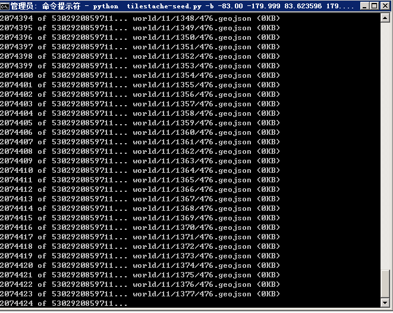

如下是部分切片在输出目录的状态：
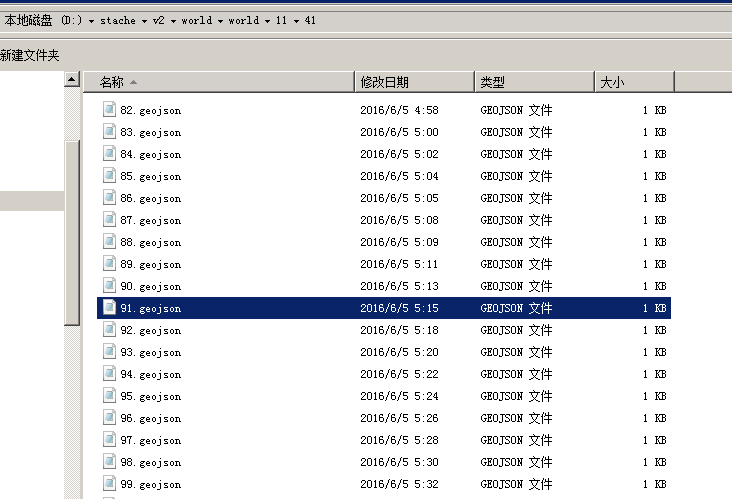

#结语
至此，部署TileStache和使用TileStache以shape文件为输入以geojson为输出的操作过程介绍完成。TileStache还有其他的一些功能，在本次没有
做深入的研究，目前来讲也用不到，所以这些内容留在后面有需要的时候再进行进一步的研究。
