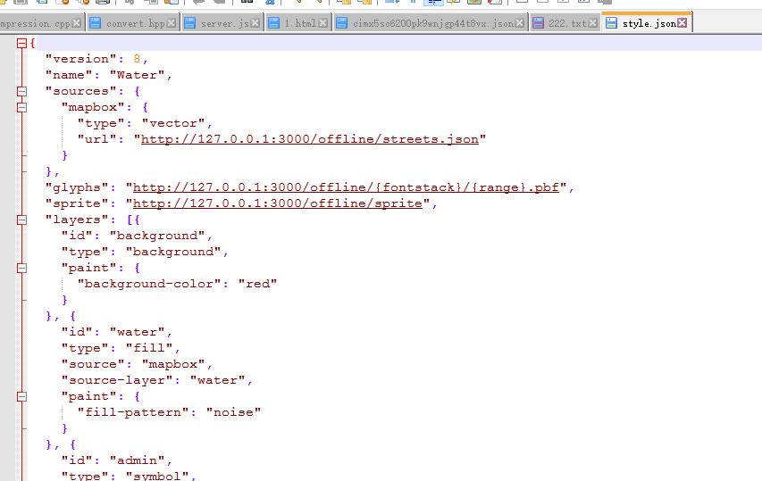
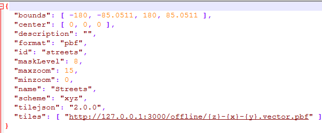

#简介
本文档结合 Mapbox GL JS 文档( https://www.mapbox.com/mapbox-gl-js/api/#Map ),其他相关官网描述和本地客户端
Mapbox-gl-native源代码对复用Mapbox Client的可能性进行探讨。Mapbox-gl-native官方源代码仓库;

Mapbox GL JS是一个使用WebGL渲染使用矢量瓦片和Mapbox地图风格定义的交互地图的JavaScript库，其是Mapbox生态系统的
一部分，和用C++实现的绑定到桌面和移动端的渲染器(Mapbox-gl-native)是兼容的。

从官网的信息分析 Mapbox GL JS和Mapbox-gl-native的提供的功能是一致的，只是实现语言不一样。因为现在Mapbox-gl-native库编译
不过去，所以对照Mapbox GL JS的功能和效果来分析Mapbox-gl-native的原代码。

本文第一阶段只讨论Mapbox展现相关的API，Mapbox上传相关的API第二阶段再做讨论。

https://github.com/mapbox/mapbox-gl-native

##Mapbox GL JS 地图API
如下是Mapbox GL JS制图的API示例：

	<!DOCTYPE html>
	<html>
	<head>
	  
	  <link href='https://api.tiles.mapbox.com/mapbox-gl-js/v0.17.0/mapbox-gl.css' rel='stylesheet'>
	</head>

	<body>
	  

	  
	</body>
	</html>

注意&lt;script> tag中的map的参数style,这个style的初始化是一个字符串，感觉非常像一个url，下面是官网对style
参数的说明：

翻译过来的意思就是这个参数指定了地图的风格，可以是指定所有者的指定风格，也可以是Mapbox提供的一组地图
风格定义。格式都必须是 mapbox://styles/:owner/:style 。地图风格定义使用Mapbox定义的一个json格式描述(
参考网址为 https://www.mapbox.com/mapbox-gl-style-spec/) 。Mapbox的地图风格定义是以Mapnik的地图风格
术语进行的。

##Mapbox-gl-native 对应的源代码
如下以Mapbox-gl-native的一段测试代码：

	TEST(Map, Offline) {
		util::RunLoop runLoop;

		auto display = std::make_shared<mbgl::HeadlessDisplay>();
		HeadlessView view(display, 1);
		DefaultFileSource fileSource(":memory:", ".");

		auto expiredItem = [] (const std::string& path) {
			Response response;
			response.data = std::make_shared<std::string>(util::read_file("test/fixtures/"s + path));
			response.expires = SystemClock::from_time_t(0);
			return response;
		};

		const std::string prefix = "http://127.0.0.1:3000";
		fileSource.put(Resource::style(prefix + "/offline/style.json"), expiredItem("offline/style.json"));
		fileSource.put(Resource::source(prefix + "/offline/streets.json"), expiredItem("offline/streets.json"));
		fileSource.put(Resource::spriteJSON(prefix + "/offline/sprite", 1.0), expiredItem("offline/sprite.json"));
		fileSource.put(Resource::spriteImage(prefix + "/offline/sprite", 1.0), expiredItem("offline/sprite.png"));
		fileSource.put(Resource::tile(prefix + "/offline/{z}-{x}-{y}.vector.pbf", 1.0, 0, 0, 0), expiredItem("offline/0-0-0.vector.pbf"));
		fileSource.put(Resource::glyphs(prefix + "/offline/{fontstack}/{range}.pbf", "Helvetica", {0, 255}), expiredItem("offline/glyph.pbf"));
		NetworkStatus::Set(NetworkStatus::Status::Offline);

		Map map(view, fileSource, MapMode::Still);
		map.setStyleURL(prefix + "/offline/style.json");

		test::checkImage("test/fixtures/offline",
						 test::render(map),
						 0.0015,
						 0.1);

		NetworkStatus::Set(NetworkStatus::Status::Online);
	}

###style
代码:

	fileSource.put(Resource::style(prefix + "/offline/style.json"), expiredItem("offline/style.json"));

指定地图的样式定义，Mapbox样式文件定义标准描述(标准定义 https://www.mapbox.com/mapbox-gl-style-spec/ ) 。 指定的文件 [style.json](./native/style.json)文件内容
。通过抓包获取到的文件 [streets-v8.json](./抓包/streets-v8.jsono)

###source
代码：
	
	fileSource.put(Resource::source(prefix + "/offline/streets.json"), expiredItem("offline/streets.json"));

指定地图数据源,Mapbpx数据源使用TileJSON标准声明(标准定义 https://github.com/mapbox/tilejson-spec ) 。指定文件[streets.json](./native/streets.json)，文件内容
。

###vector tile
代码：	

	fileSource.put(Resource::tile(prefix + "/offline/{z}-{x}-{y}.vector.pbf", 1.0, 0, 0, 0), expiredItem("offline/0-0-0.vector.pbf"));

指定矢量瓦片获取格式,(标准定义 https://github.com/mapbox/vector-tile-spec )。矢量切片文件是用Google Protobuff开发包创建的文件，但是Mapbox没有使用.proto生成的
存根文件读取这个矢量瓦片文件，而是使用了Google Protobuff的部分源码读取矢量切片文件,猜测可能是Mapbox的开发组不想依赖Google Protobuff的的库和源文件，还有就是当
.proto文件有变化时不影响矢量瓦片的解析。

###sprite

	fileSource.put(Resource::spriteJSON(prefix + "/offline/sprite", 1.0), expiredItem("offline/sprite.json"));
	fileSource.put(Resource::spriteImage(prefix + "/offline/sprite", 1.0), expiredItem("offline/sprite.png"));

这个 sprite 的意思我理解的是小块的填充底图，glyphs 是符号的意思，第一个代码指定填充的规则，第二行代码指定填充的图片。填充规则用json串描述，填充图片格式为png。

###Glyphs
代码：

	fileSource.put(Resource::glyphs(prefix + "/offline/{fontstack}/{range}.pbf", "Helvetica", {0, 255}), expiredItem("offline/glyph.pbf"));

这个东西没搞明白是干什么用的。

#总结
Mapbox 对外入口是一个JSON结构文件([mapbox-gl-style](https://www.mapbox.com/mapbox-gl-style-spec))，该文件相当与ArcGIS的MXD文档文件，承担了地图原数据的定义，连接地图风格定义文件，数据原来源等信息。其sources属性描述了数据源信息，
数据源信息组织为一个JSON结构的文件([TileJSON]( https://github.com/mapbox/tilejson-spec)),数据源类型支持矢量(仅支持矢量瓦片）、栅格（瓦片）、GeoJSON,图片(指定图片显示
的地理位置),小视频。当数据源为矢量和栅格瓦片时需要描述获取瓦片的详细信息。

