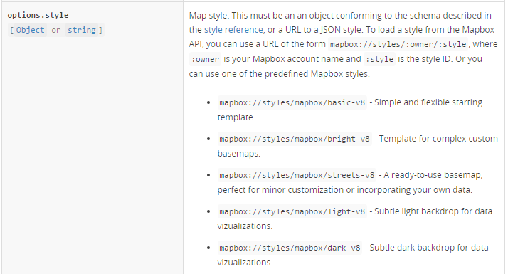

#简介
本文档结合 Mapbox GL JS 文档(https://www.mapbox.com/mapbox-gl-js/api/#Map),其他相关官网描述和本地客户端
Mapbox-gl-native源代码对复用Mapbox Client的可能性进行探讨。Mapbox-gl-native官方源代码仓库：

https://github.com/mapbox/mapbox-gl-native

##Mapbox GL JS 地图API
如下是Mapbox GL JS制图的API示例：

	<!DOCTYPE html>
	<html>
	<head>
	  
	  <link href='https://api.tiles.mapbox.com/mapbox-gl-js/v0.17.0/mapbox-gl.css' rel='stylesheet'>
	</head>

	<body>
	  

	  
	</body>
	</html>

注意&lt;script> tag中的map的参数style,这个style的初始化是一个字符串，感觉非常像一个url，下面是官网对style
参数的说明：

翻译过来的意思就是这个参数指定了地图的风格，可以是指定所有者的指定风格，也可以是Mapbox提供的一组地图
风格定义。格式都必须是 mapbox://styles/:owner/:style 。地图风格定义使用Mapbox定义的一个json格式描述(
参考网址为 https://www.mapbox.com/mapbox-gl-style-spec/) 。Mapbox的地图风格定义是以Mapnik的地图风格
术语进行的。

##Mapbox-gl-native 对应的源代码

