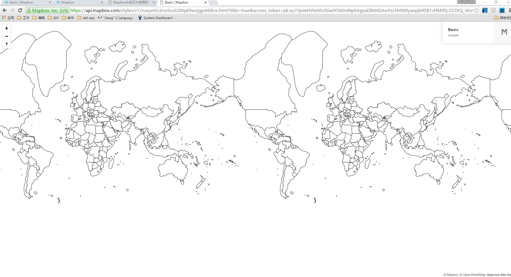

#Mapbox矢量地图服务研究
本文首先会介绍Mapbox制作地图步骤，然后分别从数据来源，数据格式,数据投影,矢量瓦片原理，地图样式定义，地图展现,其他内容等七项内容介绍Mapbox的地图服务。

##通过Mapbox地图服务发布自己的地图

1. 注册Mapbox帐号:
	* 第一步

	* 第二步

2. 使用Mapbox Studio上传矢量数据(shapefile、GeoJSON,MBTiles,KML,GPX,CSV)或者栅格数据(GeoTIFF）:
	* 新建数据集

	* 上传数据

3. 使用Mapbox Studio新建编辑地图样式或上传自定义的JSON格式的地图样式文件:
	* 地图样式

	* 新建地图样式

	* 编辑地图样式1

	* 编辑地图样式2

4. 发布地图:
	* 发布地图

5. 分享地图:
	* 分享地图1
 
	* 分享地图2

6. 通过url访问地图

##数据来源
Mapbox的矢量数据有Mapbox提供的几个数据集，自己制作地图的时候需要上传自己的矢量数据。上传的矢量数据需要是shapefile、GeoJSON,MBTiles,KML,GPX,CSV其中
之一，栅格数据只支持GeoTIFF。

Mapbox服务端的矢量数据全部是以矢量瓦片的形式存储的，而且很有可能是以MBTiles(sqlite数据库文件)存储的。移动端的离线地图官网上说明了是以MBTiles格式存
储的。

经分析在使用Mapbox客户端或其他工具上传矢量数据到服务后服务会将矢量数据进行矢量切片，但是无法在Mapbox开源代码仓库中找生产切片的相关代码。

我们自己矢量切片服务生产方式采用使用开源的TileStache将shapefile文件切割为GeoJSON格式的矢量切片，然后按照Mapbox发布的矢量切片标准将GeoJSON格式的矢量
切片文件转换为Mapbox的矢量切片文件格式（vector.pbf）。目前这条路已经走通了。

##数据格式

* shapefile: ArcGIS的矢量数据文件格式;
* GeoJSON:一种用JSON格式定义个矢量数据标准（ http://geojson.org/ );
* MBTiles:一种用于存放地图瓦片的sqlite数据库标准（官网:http://mbtiles.org );
* KML:基于XML标准的用于描述和保存地理信息的文件格式。
* GPX:GPS交换格式,一种xml文件格式；
* CSV:一种文本文件格式（具体没有详细研究);
* GeoTIFF:一种栅格影像数据;

##数据投影

Mapbox规定上传的矢量数据必须有投影信息，Mapbox的服务在切片时会将矢量数据投影到谷歌的Web 摩卡拖坐标系下。从某种意义上来说Mapbox对外提供的地图都是在
谷歌Web摩卡拖投影坐标系下的。

##矢量瓦片原理

矢量瓦片本质上是Protobuff文件，通过巧妙的设计将原本占用空间很大的地理数据编码为原来的几十分一。属性数据通过在图层级别保存一份列表，要素通过一对无符号
整形数字连接到属性数据列表，以此来减少存储属性占用的空间。对于占用空间最多地理数据，使用像素点坐标来存储,因为像素点坐标是一对整形值，所以可以使用Protobuff
的varint编码方式进行编码。varint编码的特点是越小的整数占用的空间越小，所以在生产矢量切片时Protobuff文件使用相对点坐标进行存储，例如:[[1,1],[2,2],[4,4]]的三点线
存储的时候表示为[[1,1],[1,1],[2,2]]。这样就充分利用了varint的编码特点减小了产生矢量瓦片的大小。

Mapbox使用Google Map的地图切片方案进行切片，不同之处仅在于输出的地图瓦片格式不同，Mapbox生产矢量瓦片,而Google Map生产栅格瓦片。矢量瓦片本质上是地理数据的像素化
描述，而栅格瓦片其本质是一张图片。那么在展示时矢量瓦片时是可以定制为不同的样式的，而栅格瓦片内容只能直接展示。栅格瓦片可以通过常用的图片浏览软件观察其内容而矢量
瓦片就没有这样的优势了，矢量瓦片的缺点就是它是一个封闭的二进制文件，无法通过第三方浏览软件进行浏览。

根据Google Map的切片方案原理可以知道固定等级、行号、列号的瓦片，其对应的地理范围是固定的。Mapbox规定矢量瓦片的默认长宽为4096*4096像素，对应地理范围内的坐标点
按照比例换算为像素坐标点。假设瓦片的地理范围为bbox，在这个范围内的地理坐标(mercX，mercY)换算为像素坐标（pixelX，pixelY）的计算公式如下：

pixelX = (mercX - bbox.minX)/bbox.width * 4096

pixelY = (bbox.maxY - mercy)/bbox.height *4096

经过换算后，很多距离足够近（换算为像素距离后小于一个像素）的地理坐标会变成相同的像素坐标点，这些相同的像素点坐标只会写入矢量瓦片文件一次，这种情况减少了坐标
点的传输，而且还会裁剪掉很多微小的图形。

##地图样式定义

Mapbox的使用Mapnik作为渲染地图的引擎，使用可读性较高的json文件进行地图样式定义,地图样式定了地理数据渲染的点大小、线宽、面填充、样式等等内容，在Mapbox的官网上
有专门的介绍，由于篇幅较长所以不在此文档中进行展开讨论。官网规范定义：https://www.mapbox.com/mapbox-gl-style-spec/ 。

##地图展示

Mapbox用于B/S客户端展示的Mapbox GL JS客户端，用于移动端的展示客户端iOS SDK和Android SDK。还有若干适用与不同开发语言的SDK开发包，例如JavaScript SDK， Python SDK
Mapbox CLI。

##其他内容

UTFGrid:用于在浏览器端展示交互数据的一种技术。相当于描述属性的瓦片。

#自主基于Mapbox矢量瓦片的地图服务实现方案

* 获取要发布的地理数据，并对地理数据规范化
* 使用TileStache生产GeoJSON格式的矢量切片
* 将GeoJSON的矢量切片转换为Mapbox格式(vector.pbf)的矢量切片
* [可选]将vector.pbf切片存储到MBTiles文件中，以便于移动端的地图展示
* 基于vector.pbf或Mbtiles发布矢量地图服务
* 用redis实现中间的缓冲层，提升服务响应能力
* 使用Mapbox的客户端或SDK进行前端开发

##现状

目前主要技术点已经攻关通过，可以进行服务设计和编码工作。
