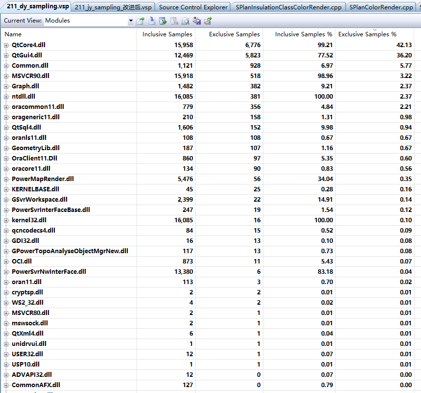
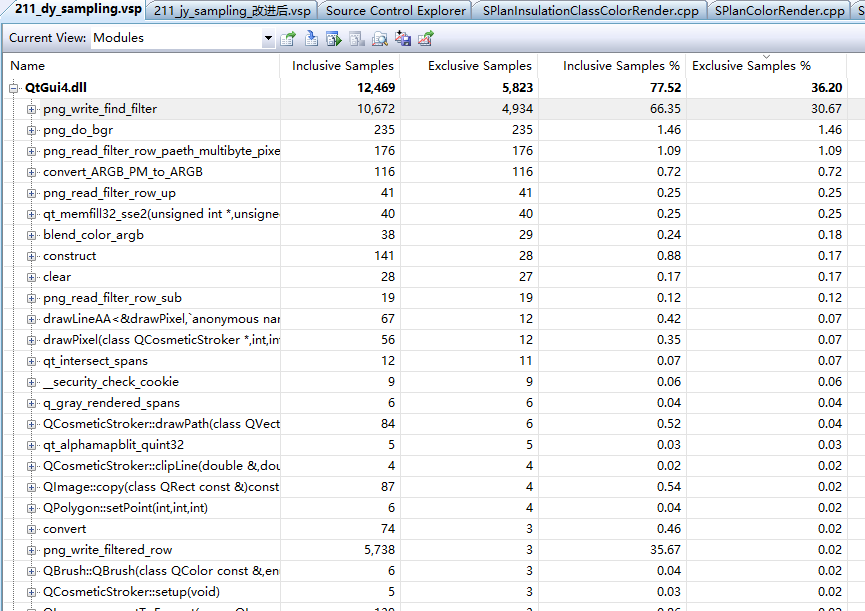
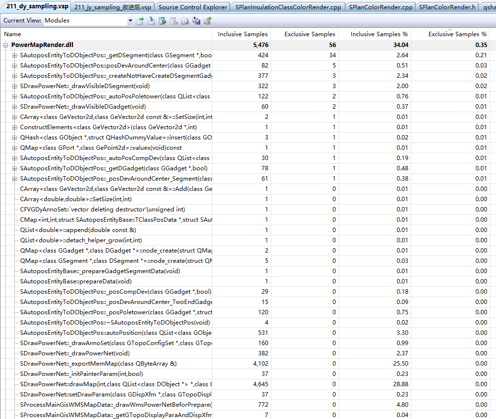
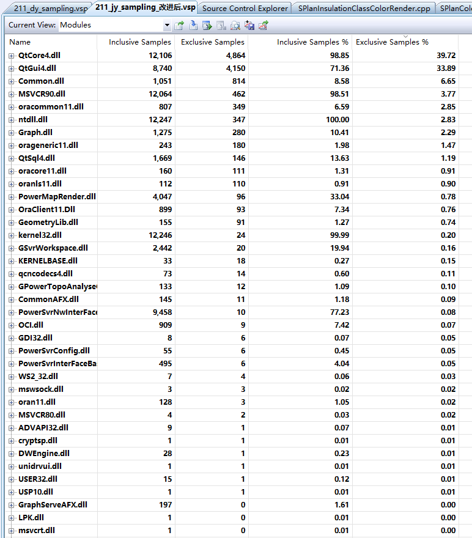
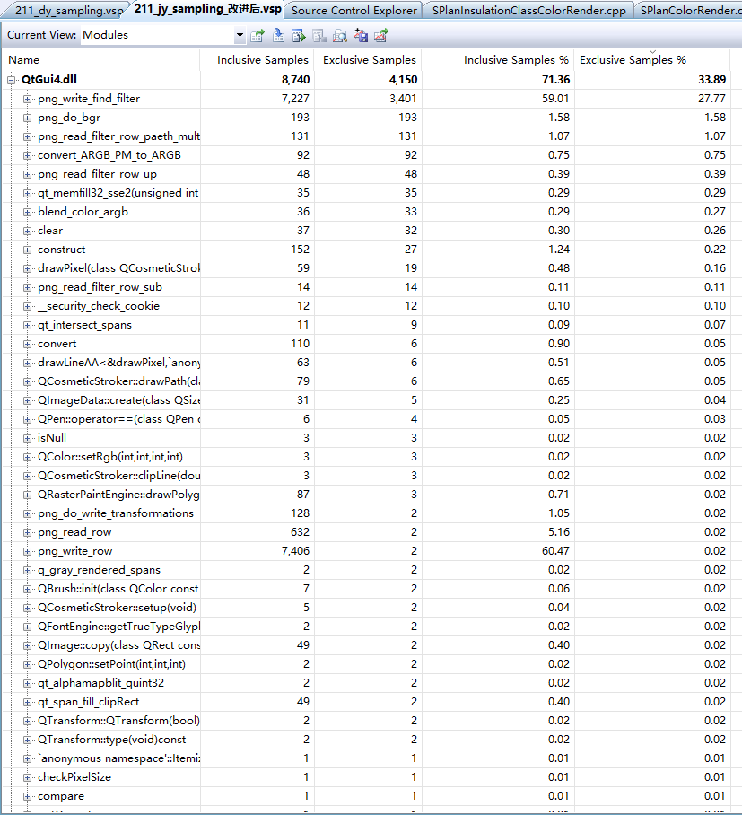
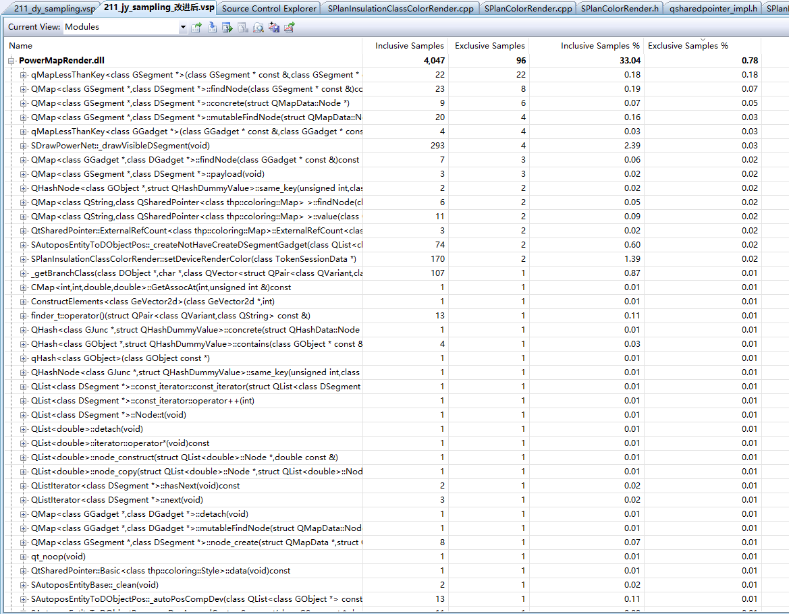

#电网WMSProfiling(抽样模式)
抽样模式的Profiling收集的数据反映机器CPU占用情况。

##电压着色
下图是按模块的独占运行时间占比降序排序的Profiling截图，途中显示QtCore4.dll、QtGui4.dll的独占抽样时间很高，其他如Common.dll、MSVCR90.dll
、Graph.dll、ntdll都是基础运行模块且独占运行时间和QtCore4.dll、QtGui4.dll相比又很少。所以不做分析。和渲染相关的模块PowerMapRender.dll的
独占抽样运行时间仅占0.35%,该模块的优化不会对服务程序CPU的运行效率有明显的提升。

###QtGui4.dll独占运行时间占比分析
QtGui4.dll抽样的独占时间为36.20%,其中png_write_find_filter的独占cpu时间为30.67%，结合检测的Profiling结果，有理由相信
QtGui4.dll库的QImage对象的保存png图片的效率不高。但目前没针对该模块可用的优化方案。

###PowerMapRender.dll独占运行时间占比分析
下图是PowerMapRender.dll内部功能运行时间占比降序排序的截图，获取线状设备D对象、调整设备中心等
的过程的独占时间占比较高，但是和QtGui4.dll的独占运行时间占比比对发现，绘制过程的独占运行时间占比都在百分之零点几左右而且
独占运行时间占比分析比较均匀，所有即使对PowerMapRender.dll模块进行优化，优化效果也不会很明显。

如下是获取线状设备D对象代码：

	DSegment* SAutoposEntityToDObjectPos::_getDSegment(GSegment *pGSegment, bool bNotExistCreate )
	{
		if(pGSegment == NULL)
		{
			return NULL;
		}
		QMap<GSegment *, DSegment *>::iterator it = m_mapGSegment2DSegment.find(pGSegment);
		if(it != m_mapGSegment2DSegment.end())
		{
			return it.value();
		}

		if(!bNotExistCreate)
		{
			return NULL;
		}
		DSegment * pDSegment = NULL;
		if(m_pSTokenDObjectMgr != NULL)
		{
			pDSegment = m_pSTokenDObjectMgr->createTokenDSegment(pGSegment);
		}
		else
		{
			pDSegment = createDSegment(pGSegment);
		}

		m_mapGSegment2DSegment.insert(pGSegment, pDSegment);

		return pDSegment;
	}

##架空线绝缘化率
下图是按模块的独占运行时间占比降序排序的Profiling截图，该图
显示有QtCore4.dll、QtGui4.dll独占运行时间占比为最高，途中反映出抽样独占运行时间占比较高的基本都是底层模块。而且
抽象的Profiling结果和电压着色的Profiling结果类似。

###QtGui4.dll独占运行时间占比分析
QtGui4.dll抽样的独占时间为33.89%,其中png_write_find_filter的独占cpu时间为27.77%，结合检测的Profiling结果，有理由相信
QtGui4.dll库的QImage对象的保存png图片的效率不高。但目前没针对该模块可用的优化方案。

###PowerMapRender.dll独占运行时间占比分析
下图是PowerMapRender.dll内部功能运行时间占比降序排序的截图，该图结果和QtGui4.dll的Profiling图对比发现，动态着色
的渲染过程独占时间占比和QtGui4.dll的独占运行时间占比相当，所以理论上对该模块的优化会对服务性能有所提升。PowerMapRender.dll
模块内部功能函数的独占运行时间占比情况如图中所示，PowerMapRender.dll内部的函数的抽样独占时间占比较高的都是QMap的排序和查找的方法，
而且独占时间占比仅为百分之零点几，所以预计对改模块的优化不会对使服务程序有更为明显的改进。

在PowerMapRender.dll模块中相对来说时间占比较高的绘制线状D对象的原代码:
	
	void SDrawPowerNet::_drawVisibleDSegment()
	{
		if(m_listDSegment == NULL|| m_listDSegment->size() == 0)
		{
			return;
		}

		GEntityTraits  & rET = m_pWD->entityTraits();
		QListIterator<DSegment*> it(*m_listDSegment);
		while (it.hasNext())
		{
			DSegment * pDSegment =it.next();

			GSegment * pGSegment = dynamic_cast<GSegment *>(pDSegment->m_pGObject);

			if (pGSegment == NULL || pGSegment->isErased() || pGSegment->m_bDisabled || !pGSegment->visibility())
			{
				continue;
			}
			
			if ((rET.m_pTopoDisplayPara != NULL && pGSegment->topoClassID()==G_CLASS_ID_CABLEDITCH) || 
				(rET.m_pTopoDisplayPara && pGSegment->topoClassID()==G_CLASS_ID_EC_PIPELINE))
			{

			}
			else
			{
				// TODO:如果当前对象和前面绘制过的对象是相同TopoClass，则不需要重新设置绘制属性
				g::uint32 uFlags = pGSegment->setDrawAttributes(&rET, pDSegment->m_clrDynValue, pDSegment->m_fLineStyleScale);
				if ((uFlags & GObject::kDrawableIsInvisible) == 0)
				{
					pGSegment->worldDraw(m_pWD, NULL, pDSegment->m_arVertex);
				}
			}
		}
	}
