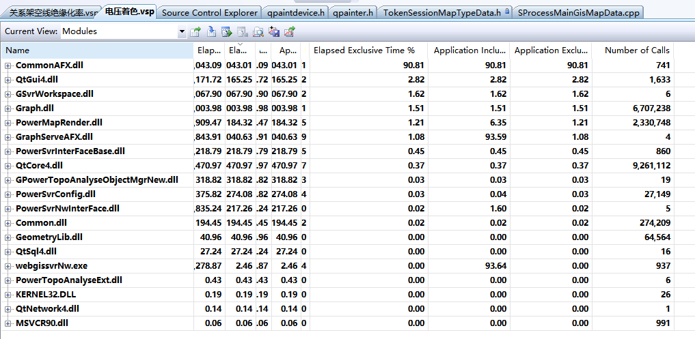
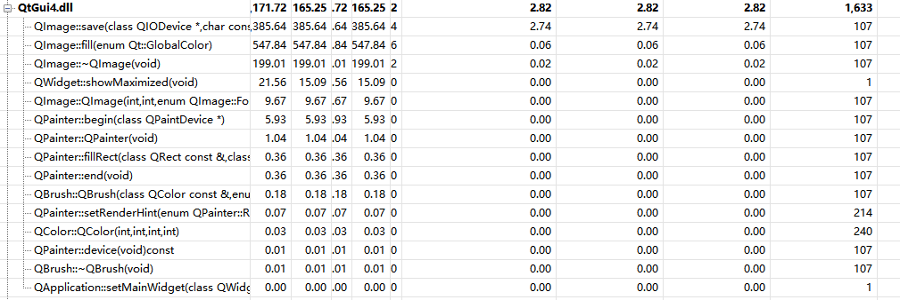
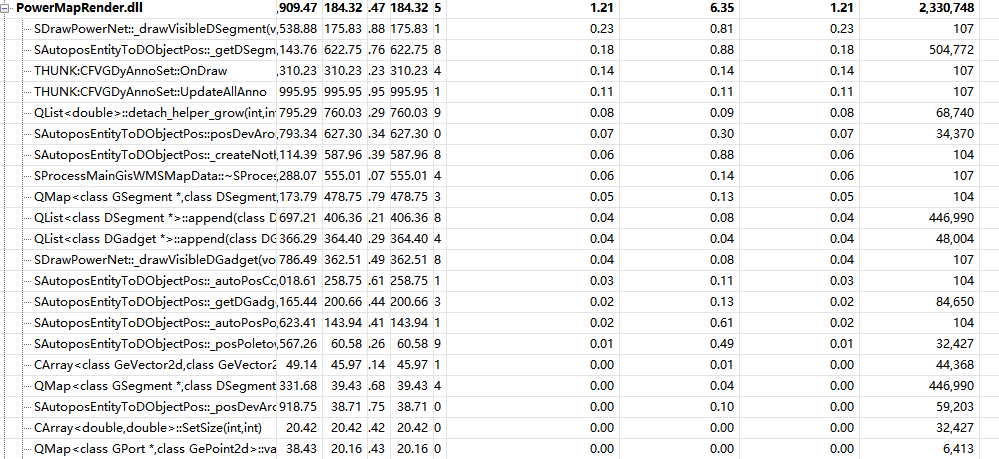
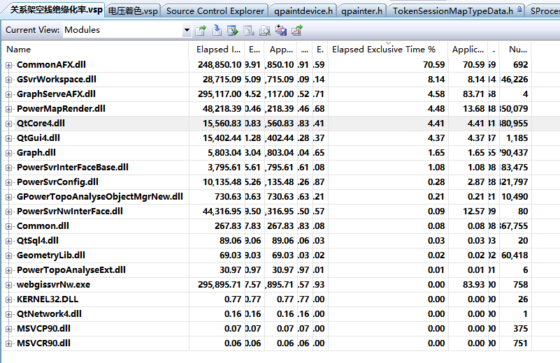
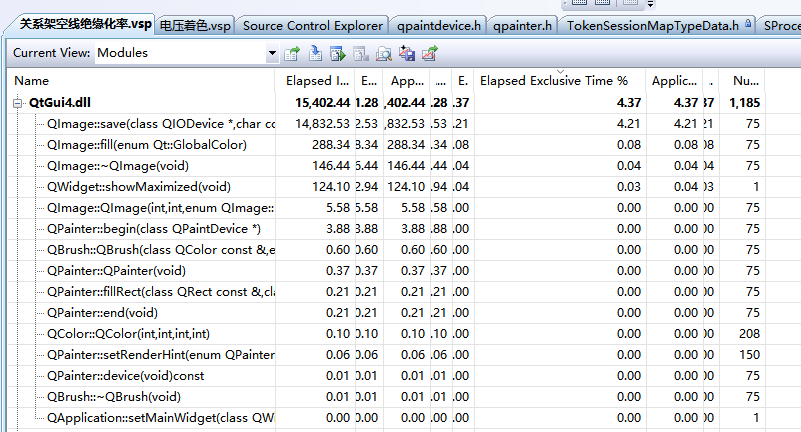
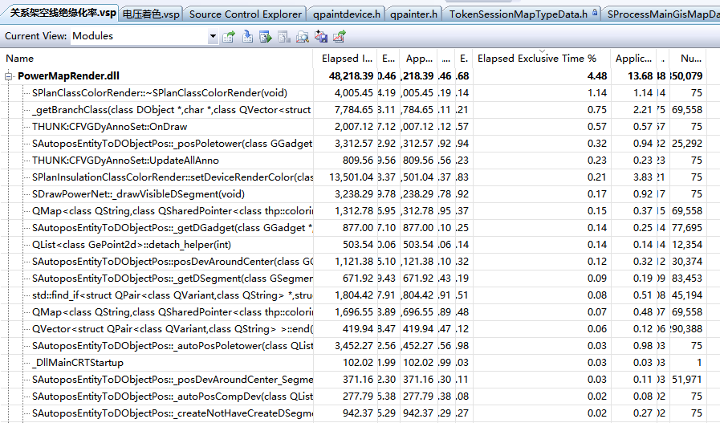
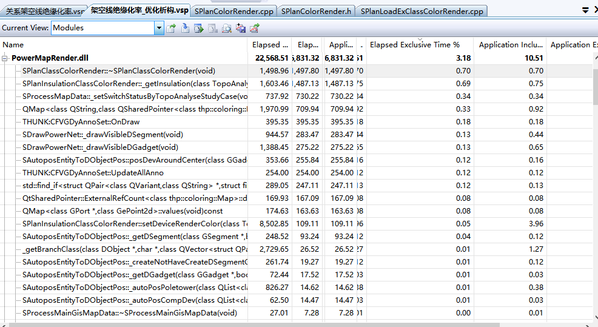

#电网WMSProfiling(检测模式)
检测模式的Profiling收集的数据包括网络，内存等整体机器情况下的代码性能。

##电压着色
下图是按模块的独占运行时间占比降序排序的Profiling截图，该图显示CommonAFX.dll独占运行时间占比为最高，但考虑到该模块是底层
功能模块，所以不对该模块进行分析，类似独占运行时间占比较高的底层模块还有GSvrWorkspace.dll和Graph.dll。其他独占运行时间占
比较高的模块有QtGui4.dll和PowerMapRender.dll,其中PowerMapRender.dll模块是渲染相关的模块。

###QtGui4.dll独占运行时间占比分析
下图是QtGui4.dll内部功能独占运行时间占比降序排序的的截图，该图显示QtGui4.dll内部的QImage的save方法时间占比过高，但由于是
Qt库的方法，暂时还没有可用的优化方案。

###PowerMapRender.dll独占运行时间占比分析
下图是PowerMapRender.dll内部功能运行时间占比降序排序的截图，该图显示绘制线状设备、获取线状设备D对象、绘制标注、更新标注
的过程的独占时间占比较高，但是和QtGui4.dll的独占运行时间占比比对发现，绘制过程的独占运行时间占比都在百分之零点几左右而且
独占运行时间占比分析比较均匀，所有即使对PowerMapRender.dll模块进行优化，优化效果也不会很明显。

如下为绘制线状设备的代码

    void SDrawPowerNet::_drawVisibleDSegment()
	{
	    if(m_listDSegment == NULL|| m_listDSegment->size() == 0)
		{
		    return;
		}

		GEntityTraits  & rET = m_pWD->entityTraits();
		QListIterator<DSegment*> it(*m_listDSegment);
		while (it.hasNext())
		{
		    DSegment * pDSegment =it.next();

			GSegment * pGSegment = dynamic_cast<GSegment *>(pDSegment->m_pGObject);

			if (pGSegment == NULL || pGSegment->isErased() || pGSegment->m_bDisabled || !pGSegment->visibility())
			{
				continue;
			}

			if ((rET.m_pTopoDisplayPara != NULL && pGSegment->topoClassID()==G_CLASS_ID_CABLEDITCH) || 
				(rET.m_pTopoDisplayPara && pGSegment->topoClassID()==G_CLASS_ID_EC_PIPELINE))
			{

			}
			else
			{
				// TODO:如果当前对象和前面绘制过的对象是相同TopoClass，则不需要重新设置绘制属性
				g::uint32 uFlags = pGSegment->setDrawAttributes(&rET, pDSegment->m_clrDynValue, pDSegment->m_fLineStyleScale);
				if ((uFlags & GObject::kDrawableIsInvisible) == 0)
				{
					pGSegment->worldDraw(m_pWD, NULL, pDSegment->m_arVertex);
				}
			}
		}
	}

如下是获取线状设备D对象代码：

	DSegment* SAutoposEntityToDObjectPos::_getDSegment(GSegment *pGSegment, bool bNotExistCreate )
	{
		if(pGSegment == NULL)
		{
			return NULL;
		}
		QMap<GSegment *, DSegment *>::iterator it = m_mapGSegment2DSegment.find(pGSegment);
		if(it != m_mapGSegment2DSegment.end())
		{
			return it.value();
		}

		if(!bNotExistCreate)
		{
			return NULL;
		}
		DSegment * pDSegment = NULL;
		if(m_pSTokenDObjectMgr != NULL)
		{
			pDSegment = m_pSTokenDObjectMgr->createTokenDSegment(pGSegment);
		}
		else
		{
			pDSegment = createDSegment(pGSegment);
		}

		m_mapGSegment2DSegment.insert(pGSegment, pDSegment);

		return pDSegment;
	}

绘制标注和更新标注的代码是间接的调用，而且独占运行时间占比不高，不再此粘贴代码。

##架空线绝缘化率
下图是按模块的独占运行时间占比降序排序的Profiling截图，该图
显示CommonAFX.dll独占运行时间占比为最高，但考虑到该模块是底层
功能模块，所以不对该模块进行分析，类似独占运行时间占比较高的
底层模块还有QtCore4.dll、GSvrWorkspace.dll和Graph.dll。其他独占运行时间占
比较高的模块有QtGui4.dll和PowerMapRender.dll,其中PowerMapRender.dll
模块是渲染相关的模块。

###QtGui4.dll独占运行时间占比分析
下图是QtGui4.dll内部功能独占运行时间占比降序排序的的截图，该图显示QtGui4.dll内部的QImage的save方法时间占比过高，但由于是
Qt库的方法，暂时还没有可用的优化方案。

###PowerMapRender.dll独占运行时间占比分析
下图是PowerMapRender.dll内部功能运行时间占比降序排序的截图，该图结果和QtGui4.dll的Profiling图对比发现，动态着色
的渲染过程独占时间占比和QtGui4.dll的独占运行时间占比相当，所以理论上对该模块的优化会对服务性能有所提升。PowerMapRender.dll
模块内部功能函数的独占运行时间占比情况如图中所示，独占运行时间占比按降序顺序为动态着色渲染器析构函数、获取设备所有线路、绘画
、调整杆塔位置、更新标注信息、设置动态对象颜色、绘制线状设备过程。

渲染器析构函数代码:

	SPlanClassColorRender::~SPlanClassColorRender()
	{
		QMap<QString, QSharedPointer<thp::coloring::Map> >* pClasses = (QMap<QString, QSharedPointer<thp::coloring::Map> >*)(m_pClasses);
		delete pClasses;
		m_pClasses = NULL;
	}

　　怀疑该段代码效率较低的可能原因有两个
1. QMap对象是从堆上创建的，可以修改为将QMap从栈上创建；
2. QMap的析构过程比较耗时。

优化后渲染器析构代码:

	SPlanClassColorRender::~SPlanClassColorRender()
	{
	}

下图是对渲染器的析构着色对象优化为从栈上创建Profiling文件的截图，可见优化后渲染器的析构函数独占时间占比降低了40%,整个模块的独占时间占比
降低了38%。

目前对获取设备所属线路的代码还没有优化方案，下面是获取设备所属线路原代码:
	
	QString _getBranchClass(DObject* pDObj, char* szFieldName, QVector< QPair<QVariant, QString> >& vecDic)
	{
		GPath* pPath = thp::coloring::Map::getObjectPath(pDObj->m_pGObject);
		if(NULL == pPath)
			return "";

		GRowBuffer* pBuffer = pPath->rowBuffer();
		if(NULL == pBuffer)
			return "";

		QVariant var;
		if ( g::eOk != pBuffer->value(szFieldName, var) )
			return "";

		QVector< QPair<QVariant, QString> >::iterator it = std::find_if(vecDic.begin(), vecDic.end(), finder_t(var));
		if( it == vecDic.end() )
			return "";

		return it->second;
	}

	GPath * thp::coloring::Map::getObjectPath(GObject * pObj) 
	{
		GObjectId feederId;
		GTopoClassDef * pClass=pObj->topoClassDef();
		GRowBuffer * pRB=pObj->rowBuffer();

		if (pClass->classID() == G_CLASS_ID_DF_LINKLINE)
		{
			// 电气连接线，搜索末端的设备
			// 末端一般应当是配变/跌落/开关等
			GJunc * pJunc = ((GSegment *)pObj)->m_pTail->m_pJunc;
			if (pJunc != 0)
			{
				int nObjs = pJunc->m_arConn.GetSize();
				for (int i=0; i<nObjs; i++)
				{
					GObject * pScanObj = (GObject *)pJunc->m_arConn.GetAt(i);
					if (pScanObj != pObj && pScanObj->rowBuffer()->value("FEEDERID",feederId) == g::eOk)
					{
						break;
					}
				}
			}
		}
		else
		{
			bool bMainLineSet=false;

			if (pClass->m_nAppFlags & APPFLAGS_COMPOSITE_DEVICE)
			{
				// 对于组合设备, 如果MAIN_LINE字段有效, 使用相应的颜色
				short sMainLine=0;
				g::eErr eErr=pRB->value("MAIN_LINE",sMainLine);
				if (eErr==g::eOk && sMainLine>0)
				{
					CString strBranchFldName,strFeederFldName;
					_getCompDevInletFieldName(sMainLine-1,strBranchFldName,strFeederFldName);
					if (pRB->value(strFeederFldName,feederId)==g::eOk)
					{
						bMainLineSet=true;
					}
				}
			}
			// 单回杆塔参与线路相关的着色，多回不考虑
			else if (pClass->classID() == G_CLASS_ID_DF_POLETOWER && ((GGadget *)pObj)->portCount() == 1)
			{
				GPath * pBranch = _getPolePortBranch(((GGadget *)pObj)->port(0));
				if (pBranch != NULL && pBranch->getFeederPath() != NULL)
				{
					feederId = pBranch->getFeederPath()->objectId();
				}
			}

			if (!bMainLineSet)
			{
				pRB->value("FEEDERID",feederId);
			}
		}

		return (GPath *)feederId.object();
	}

