#南网符号说明

#说明

编号由5到10位数表示，编码规则位从左向右2位表示大类，01表示站内，02表示输配电
站外设备；3位表示设备类别，2或3位表示子类型编号，最后两位表示状态。如下：
01 130 00 00对应 站内, 130编号类,无子类型,状态为0的编号。

线的备注内容为颜色，线宽。

#发电

|序号|名称|图元|规格说明|备注|
|:---|:---|:---:|---|---|
|0210010|水电厂|| | |
|0210020|火电厂|| | |
|0210050|核电厂|| | |

#变电

|序号|名称|图元|规格说明|备注|
|:---|:---|:---:|---|---|
|0211010|变电站|| | |
|0211020|开关站|| | |
|0211030|换流站|| | |
|0211040|串补站|| | |
|02116|变电站端子|| | |

##变电站内

|序号|名称|图元示例|规格说明|备注|
|:---|:---|:---:|---|---|
|01120|变电站内母线|||未配置|
|01125|变电站内母线段|| |绿色,线宽位5 |
|01126|变电站内电缆|| |浅粉，线宽0.25 |
|01128|变电站内电气连接线|| |绿色,线宽位2 |
|011300000|变电站内电缆终端头@无效|| | |
|011300001|变电站内电缆终端头@有效|| | |
|0113610|双绕组变压器|| | |
|0113611|双绕组变压器 (有载调压)|| | |
|0113612|双绕组变压器 (星形-星形连接)|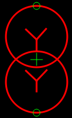| | |
|0113613|双绕组变压器 (三角形-星形连接)|| | |
|0113613|双绕组变压器 (三角形-星形连接)|| | |
|0113614|双绕组变压器 (星形-三角形连接)|| | |
|0113615|双绕组变压器 (三角形-三角形连接)|| | |
|0113616|双绕组变压器Dyn (中性点引出三角形-星形连接)|| | |
|0113617|双绕组变压器Yyn (中性点引出星形-星形连接)|| | |
|0113618|双绕组变压器YNd (中性点引出星形-三角形连接)|| | |
|0113619|双绕组有载可调变压器Dyn (中性点引出三角形-星形连接)|| | |
|0113620|双绕组有载可调变压器Yyn (中性点引出星形-星形连接)|| | |
|0113621|双绕组有载可调变压器YNd (中性点引出星形-三角形连接)|| | |
|0113622|双绕组自耦变压器 (星形-星形连接)|| | |
|0113623|双绕组自耦可调变压器 (星形-星形连接)|| | |
|0113624|双绕组自耦可调变压器 (星形-三角形连接)|| | |
|0113625|双绕组自耦可调变压器 (三角形-星形连接)|| | |
|0113630|三绕组变压器|| ||
|0113631|三绕组变压器 (星形-三角形-星形连接)|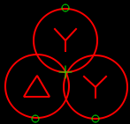| | |
|0113632|三绕组变压器 (星形-星形-三角形连接)|| | |
|0113633|三绕组变压器 (三角形-星形-星形连接)|| | |
|0113634|三绕组变压器 (星形-星形-开口三角形连接)|| | |
|0113635|三绕组变压器 (三角形-三角形-星形连接)|| | |
|0113636|三绕组变压器 (星形-星形-星形连接)|| | |
|0113637|三绕组变压器YNynd (中性点引出星形-星形-三角形连接)|| | |
|0113638|三绕组变压器YNdy (中性点引出星形-三角形-星形连接)|| | |
|0113639|三绕组可调变压器 (三角形-三角形-星形连接)|| | |
|0113640|三绕组有载可调变压器YNynd (中性点引出星形-星形-三角形连接)|| | |
|0113641|三绕组有载可调变压器YNynd (中性点引出星形-星形-三角形连接)|| | |
|0113642|三绕组有载可调变压器 (星形-星形-三角形连接)|| | |
|0113643|三绕组有载可调变压器 (星行-星形-星形连接)|| | |
|0113644|双绕组自偶变压器 (星形-三角形连接)|| | |
|0113645|双绕组自偶变压器 (三角形-星形连接)|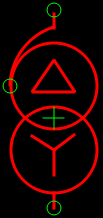| | |
|0113710|站用变|| | |
|0113720|站用变接地变两用|| | |
|0113730|接地变|| | |
|011401000|断路器@分|| | |
|011401001|断路器@合|| | |
|011402010|手车断路器@合/运行|| | |
|011402020|手车断路器@分/热备|| | |
|011402030|手车断路器@分/冷备|| | |
|011402040|手车断路器@实验/检修|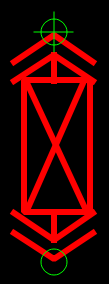| | |
|011403000|三工位断路器@分|| | |
|011403001|三工位断路器@合|| | |
|011403002|三工位断路器@接地|| | |
|011411000|负荷开关@分|| | |
|011411001|负荷开关@合|| | |
|011412010|手车负荷开关@合/运行|| | |
|011412020|手车负荷开关@分/热备|| | |
|011412030|手车负荷开关@分/冷备|| | |
|011412040|手车负荷开关@试验/检修|| | |
|011413000|三工位负荷开关@分|| | |
|011413001|三工位负荷开关@合|| | |
|011413002|三工位负荷开关@接地|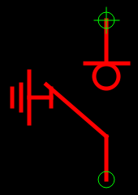| | |
|011421000|隔离开关@接地|| | |
|011421001|隔离开关@接地|| | |
|011422010|手车隔离开关@合|| | |
|011422020|手车隔离开关@分|| | |
|011422040|手车隔离开关@试验/检修|| | |
|011430000|接地刀闸@分|| | |
|011430001|接地刀闸@合|| | |
|011440000|熔断器@分|| | |
|011440001|熔断器@合|| | |
|01145|组合开关|| | |
|0115010|避雷器(有接地)|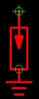| | |
|0115020|避雷器(无接地)|| | |
|0115110|电抗器(有接地)|| | |
|01152|电容器|| | |
|01153|耦合电容器|| | |
|01154|电压互感器| | | |
|0115410|双绕组电压互感器|| | |
|0115411|双绕组电容式电压互感器|| | |
|0115420|抽压电压互感器|| | |
|0115430|三绕组电压互感器|| | |
|0115440|四绕组电压互感器|| | |
|0115450|五绕组电压互感器|| | |
|0115460|电容式电压互感器|| | |
|0115470|三相电容式电压互感器|| | |
|0115480|四相电容式电压互感器|| | |
|0115490|手车压变(带熔断器)|| | |
|01155|电流互感器|| | |
|0115510|单相一个次绕组|| | |
|0115511|两相一个次绕组|| | |
|0115512|三相一个次绕组|| | |
|0115513|单相两次绕组|| | |
|0115514|两相两个次绕组|| | |
|0115515|三相两个次绕组|| | |
|0115516|单相三个次绕组|| | |
|0115517|两相三个次绕组|| | |
|0115518|三相三个次绕组|| | |
|0115519|单相四个次绕组|| | |
|0115520|两相四个次绕组|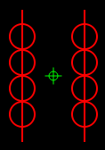| | |
|0115521|三相四个次绕组|| | |
|0115522|单相五个次绕组|| | |
|0115523|两相五个次绕组|| | |
|0115524|三相五个次绕组|| | |
|0115525|单相六个次绕组|| | |
|0115526|两相六个次绕组|| | |
|0115527|三相六个次绕组|| | |
|01156|带电显示器|| | |
|01157|故障指示器|| | |
|01158|电感器|||未配置|
|01159|消弧线圈|| | |
|01160|阻波器|| | |
|01161|消谐器|| | |
|01162|穿墙套管|| | |
|01163|站内放电间隙|| | |
|01164|接地电阻|| | |
|01165|继电保护装置|| | |
|01180|主变端子|| |未配置|
|01182|组合开关端子|||未配置|
|01183|电压互感器端子|||未配置|
|01190|变电站内间隔|||未配置|
|01191|组合电器|||未配置|
|01192|组合电器气室|||未配置|

#输电
|序号|名称|图元示例|规格说明|备注|
|:---|:---|:---:|---|---|
|02200|线路|||未配置|
|02210|架空线段||| 0.5p|
|02211|电缆线段||| 0.5p|
|02212|电气连接线|| | 2p|
|022200000|电缆终端头@无效|| | |
|022200001|电缆终端头@有效|| | |
|02230|输电物理杆塔|| | |
|022301010|角钢塔@直线|| | |
|022301020|角钢塔@耐张|| | |
|022302010|钢管塔@直线|| | |
|022302020|钢管塔@耐张|| | |
|022303010|钢管杆@直线|| | |
|022303020|钢管杆@耐张|| | |
|022304010|砼杆@直线|| | |
|022304020|砼杆@耐张|| | |
|022305010|拉线杆@直线|| | |
|022305020|拉线杆@耐张|| | |
|022306010|特殊塔@直线|| | |
|022306020|特殊塔@耐张|| | |
|02232|电缆分支箱|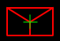| | |
|02235|电缆中间接头|| | |
|02236|线路监测装置|| | |
|02250|逻辑杆塔|| | |
|02252|电缆分支箱端子|||未配置|
|02274|交叉跨越|||未配置|
|02280|耐张段|||未配置|
|02300|线路分支|||未配置|

#配电

|序号|名称|图元示例|规格说明|备注|
|:---|:---|:---:|---|---|
|02300|线路分支|||未配置|
|02305|架空导线|||未配置|
|02306|电缆|||未配置|
|02310|架空线段|||未配置|
|02311|电缆段|||未配置|
|02312|电气连接线|| | |
|023200000|电缆终端头@有效|| | |
|023200001|电缆终端头@无效|| | |
|02330|电缆终端头|||未配置|
|02331|户外开关箱|||未配置|
|02332|电缆分接箱|| | |
|0233210|电缆分支箱(带开关)|| | |
|0233220|电缆分支箱(不带开关)|| | |
|0233230|箱式自动开关|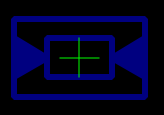| | |
|0233240|箱式自动开关(出线带接地)|| | |
|02333|配电站|| | |
|0233310|局属(公变)|| | |
|0233320|用户(专变)|| | |
|02334|箱变|| | |
|0233410|箱式公变|| | |
|0233410|箱式公变|| | |
|0233410|箱式公变|| | |
|0233410|箱式公变|| | |
|0233410|箱式公变|| | |
|0233410|箱式公变|| | |
|02335|台变|| | |
|0233510|柱上公变|| | |
|0233520|柱上专变|| | |
|0233530|柱上专变(一户一表)|| | |
|0233540|屋顶专变|| | |
|02337|柱上无功补偿箱|| | |
|02338|中低压物理杆塔|| | |
|023381010|水泥杆@直线杆塔|| | |
|023381020|水泥杆@耐张杆塔|| | |
|023382010|铁塔@直线杆塔|| | |
|023382020|铁塔@耐张杆塔|| | |
|023383010|钢管杆@直线杆塔|| | |
|023383020|钢管杆@耐张杆塔|| | |
|023384010|木杆@直线杆塔|| | |
|023384020|木杆@耐张杆塔|| | |
|023385010|钢包杆@直线杆塔|| | |
|023385020|钢包杆@耐张杆塔|| | |
|023386010|钢管杆@直线杆塔|| | |
|023386020|钢管杆@耐张杆塔|| | |
|023387010|二眼横旦@直线杆塔|| | |
|023387020|二眼横旦@耐张杆塔|| | |
|023388010|四眼横旦@直线杆塔|| | |
|023388020|四眼横旦@耐张杆塔|| | |
|023389010|尖铁@直线杆塔|| | |
|023389020|尖铁@耐张杆塔|| | |
|0233810010|门型杆@直线杆塔|| | |
|0233810020|门型杆@耐张杆塔|| | |
|0233811010|龙门吊@直线杆塔|| | |
|0233811020|龙门吊@耐张杆塔|| | |
|0233812010|三联杆@直线杆塔|| | |
|0233812020|三联杆@耐张杆塔|| | |
|0233812110|街码@直线杆塔|| | |
|0233812120|街吗@耐张杆塔|| | |
|02339|柱上断路器|| | |
|023391000|普通断路器@分|| | |
|023391001|普通断路器@合|| | |
|023392000|自动化断路器@分|| | |
|023392001|自动化断路器@合|| | | 
|02340|柱上负荷开关|| | |
|023401000|普通负荷开关@分|| | |
|023401001|普通负荷开关@合|| | |
|023402000|自动化符合开关@分|| | |
|023402001|自动化符合开关@合|| | |
|0234040||| |未配置|
|02342|柱上隔离开关|| | |
|023420000|@分|| | |
|023420001|@合|| | |
|02343|跌落式熔断器|| | |
|023430000|@分|| | |
|023430001|@合|| | |
|02344|柱上故障指示器|| | |
|0234410|普通故障指示器|| | |
|0234420|自动化故障指示器|| | |
|02345|柱上计量装置|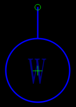| | |
|02346|电缆中间接头|| | |
|02347|电气连接点|| | |
|02349|柱上避雷器|| | |
|0234900|标准图符|| | |
|0234901|左向图符|| | |
|02350|电气连接点|| | |
|02351||| | 未配置|
|02352||| | 未配置|
|02353||| | 未配置|
|02356||| | 未配置|
|02360||| | 未配置|
|02361||| | 未配置|
|02362||| | 未配置|
|02363||| | 未配置|
|02364||| | 未配置|
|02365||| | 未配置|
|02366||| | 未配置|
|02367||| | 未配置|
|02380|交叉跨越|| | 未配置|
|0238010|500kV线路| | |未配置|
|0238011|330kV线路| | |未配置|
|0238012|220kV线路| | |未配置|
|0238013|110(66)kV线路| | |未配置|
|0238014|35kV线路| | |未配置|
|0238015|10kV线路| | |未配置|
|0238016|低压线路| | |未配置|
|0238017|一级通信线| | |未配置|
|0238018|二级及以下通信线| | |未配置|
|0238019|高速公路| | |未配置|
|0238020|一级公路| | |未配置|
|0238021|二级及以下公路| | |未配置|
|0238022|准轨铁路| | |未配置|
|0238023|窄轨铁路| | |未配置|
|0238024|广播线| | |未配置|
|0238025|通航河流| | |未配置|
|0238026|不通航河流| | |未配置|
|0238027|电车线路| | |未配置|
|0238028|管道及索道| | |未配置|
|0238029|其他| | |未配置|
|02389|双端电缆终端头| | |未配置|

##配电站内

|序号|名称|图元示例|规格说明|备注|
|:---|:---|:---:|---|---|
|01398|双端电缆终端头|||未配置|
|01400|中低压站内母线|||未配置|
|01406|中压临时站内电缆组|||未配置|
|01410|中低压站内母线段||| 3p|
|01411|站内电缆|||未配置|
|01412|中低压站内电气连接线||| 1p|
|014200000|电缆终端头@有效||||
|014200001|电缆终端头@无效||||
|01421|电缆终端头|| | |
|01430|中低压站内电气连接线|||未配置|
|01431|变压器|||未配置|
|0143101|公变|| | | 
|0143102|专变|| | |
|01433|断路器|| | |
|014331000|断路器@分|| | | 
|014331001|断路器@合|| | |
|014332010|手车断路器@合/运行|| | |
|014332020|手车断路器@分/热备|| | |
|014332030|手车断路器@分/冷备|| | |
|014332040|手车断路器@试验/检修|| | |
|014333000|三工位断路器@分|| | |
|014333001|三工位断路器@合|| | |
|014333002|三工位断路器@接地|| | |
|014334000|自动化断路器@分|| | |
|014334001|自动化断路器@合|| | |
|014335000|熔断式断路器@分|| | |
|014335001|熔断式断路器@合|| | |
|014336000|熔断式三工位断路器@分|| | |
|014336001|熔断式三工位断路器@合|| | |
|014336002|熔断式三工位断路器@接地|| | |
|01434|负荷开关| | | |
|014341000|负荷开关@分|| | |
|014341001|负荷开关@合|| | |
|014342010|手车负荷开关@合/运行|| | |
|014342020|手车负荷开关@分/热备|| | |
|014342030|手车负荷开关@分/冷备|| | |
|014342040|手车负荷开关@试验/检修|| | |
|014343000|三工位负荷开关@分|| | |
|014343001|三工位负荷开关@合|| | |
|014343002|三工位负荷开关@接地|| | |
|014344000|熔断式负荷开关@分|| | |
|014344001|熔断式负荷开关@合|| | |
|014345000|自动化负荷开关@分|| | |
|014345001|自动化负荷开关@合|| | |
|014346000|熔断式三工位开关@分|| | |
|014346001|熔断式三工位开关@合|| | |
|014346002|熔断式三工位开关@接地|| | |
|01435|隔离开关 | | | |
|014351000|隔离开关@分|| | |
|014351001|隔离开关@合|| | |
|014352010|手车隔离开关@合|| | |
|014352020|手车隔离开关@分|| | |
|014352030|手车隔离开关@|| |未配置 |
|014352040|手车隔离开关@试验/检修|| | |
|01436|接地刀闸|| | |
|014361000|接地刀闸(默认)@分|| | |
|014361001|接地刀闸(默认)@合|| | |
|014362000|接地刀闸(左向把手)|| | |
|014362001|接地刀闸(左向把手)|| | |
|01437|熔断器|| | |
|014370000|@合|| | |
|014370001|@分|| | |
|01438|组合开关|| | |
|0143810|组合开关|| | |
|0143820|双向隔离开关|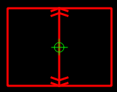| | |
|0143830|T型开关|| | |
|0143840|V型开关|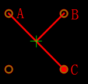| | | 
|01439|避雷器|| | |
|0143910|避雷器(默认)|| | |
|0143920|避雷器(左向把手)|| | |
|01440|电抗器|| | |
|01441|电容器|||未配置|
|01442|电压互感器||||
|0144210|双绕组电压互感器|| | |
|0144220|抽压电压互感器|| | |
|0144230|三绕组电压互感器|| | |
|0144240|四绕组电压互感器|| | |
|0144250|五绕组电压互感器|| | |
|0144260|电容器电压互感器|| | |
|0144270|三相电容式电压互感器|| | |
|0144280|四相电容式电压互感器|| | |
|0144290|手车压变(带熔断器)|| | |
|01443|电流互感器|| | |
|0144310|单相一个次级绕组电流互感器|| | |
|0144311|两相一个次级绕组电流互感器|| | |
|0144312|三相一个次级绕组电流互感器|| | |
|0144313|单相两个次级绕组电流互感器|| | |
|0144314|两相两个次级绕组电流互感器|| | |
|0144315|三相两个次级绕组电流互感器|| | |
|0144316|单相三个次级绕组电流互感器|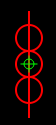| | |
|0144317|两相三个次级绕组电流互感器|| | |
|0144318|三相三个次级绕组电流互感器|| | |
|0144319|单相四个次级绕组电流互感器|| | |
|0144320|两相四个次级绕组电流互感器|| | |
|0144321|三相四个次级绕组电流互感器|| | |
|0144322|单相五个次级绕组电流互感器|| | |
|0144323|两相五个次级绕组电流互感器|| | |
|0144324|三相五个次级绕组电流互感器|| | |
|0144325|单相六个次级绕组电流互感器|| | |
|0144326|两相六个次级绕组电流互感器|| | |
|0144327|三相六个次级绕组电流互感器|| | |
|01444|带电显示器|| | |
|01445|故障指示器|||故障指示器|
|0144410|普通故障指示器|||未配置|
|0144420|自动化故障指示器|||未配置|
|01446|发电机|| | |
|01447|发电机|| | |
|01449|继电保护装置|| | |
|01450|电缆肘形头||||
|014500000|@分|| | |
|014500001|@合|| | |
|01451|测量仪表|| | |
|01452|计量仪表|| | |
|0145210|高供高记表|| | |
|01453|自动化终端设备|| | |
|0145310|FTU|| | |
|0145320|DTU|| | |
|0145330|TTU|| | |
|01482|组合开关端子|||未配置|
|01484|电压互感器端子|||未配置|
|01490|中压柜|| | |
|01498|PT柜|| | |
|01499|计量柜|| | |

#低压

|序号|名称|图元示例|规格说明|备注|
|:---|:---|:---:|---|---|
|02500|低压线路分支| | |未配置|
|02505|低压架空导线| | |未配置|
|02506|低压电缆| | |未配置|
|02510|低压架空线段|| | 0.25p|
|02511|低压电缆段||| 025p|
|02512|低压电气连接线||| 025p|
|02516|低压电缆终端头||||
|025160000|@无效||||
|025160001|@有效||||
|02517|低压电缆终端头||||
|02520|低压配电箱||||
|02521|低压落火点||||
|0252110|落火点||||
|0252120|落火点(报装)||||
|02522|低压电缆中间接头|||未配置|
|02523|低压电气连接点||||
|02524|低压断连|||未配置|
|02525|低压柱上断路器|||配图和数据库中不一致|
|025251000|普通断路器||||
|025251001|普通断路器||||
|02526|低压柱上隔离开关||||
|025261000|||||
|025261001|||||
|02527|低压终端||||
|02528|低压配电房||||
|02530|低压配电箱端子|||未配置|
|02531|低压落火点端子|||未配置|
|02538|低压配电房端子|||未配置|
|02596|低压断连端子|||未配置|
|02599|低压双端电缆终端头|||未配置|

##低压站内

|序号|名称|图元示例|规格说明|备注|
|:---|:---|:---:|---|---|
|01540|低压临时站内电缆组|||未配置|	
|01546|低压站内电缆|||红色,0.75p|	
|01548|低压站内架空线段		|||红色,0.75p|	
|01550|低压站内电缆终端头	||||	
|015500000|低压站内电缆终端头	||||	
|015500001|低压站内电缆终端头	||||	
|01556|低压站内断路器||||	
|015561000|断路器@分||||	
|015561001|断路器@合||||	
|015563000|三工位断路器@分||||	
|015563001|三工位断路器@合||||	
|015563002|三工位断路器@接地||||	
|015564000|自动化断路器@分||||	
|015564001|自动化断路器@合||||	
|01557|低压站内负荷开关||||	
|015571000|负荷开关@分||||	
|015571001|负荷开关@合||||	
|015573000|三工位负荷开关@分||||	
|015573001|三工位负荷开关@合||||	
|015573002|三工位负荷开关@接地||||	
|015574000|@分||||	
|015574001|@合||||	
|015575000|自动化负荷开关@分||||	
|015575001|自动化负荷开关@合||||	
|01558|低压站内隔离开关	||||	
|015580000|低压站内隔离开关@分||||	
|015580001|低压站内隔离开关@合||||					
|01559|低压站内接地刀闸||||	
|015590000|接地刀闸@分||||	
|015590001|接地刀闸@合||||	
|01560|低压站内熔断器||||	
|015600000|熔断器@分||||	
|015600001|熔断器@合||||	
|01561|低压站内表箱||||	
|01567|低压站内避雷器||||
|01568|低压站内配电箱||||	
|01569|低压站内电容器||||	
|01570|低压站内电压互感器||||
|0157010|双绕组电压互感器||||
|0157020|抽压电压互感器|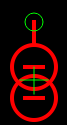|||
|0157030|三绕组电压互感器||||
|0157040|四绕组电压互感器||||
|0157050|五绕组电压互感器|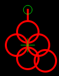|||
|0157060|电容式电压互感器|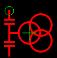|||
|0157070|三相电容式电压互感器||||
|0157080|四相电容式电压互感器|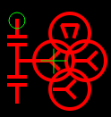|||
|0157090|手车压变(带熔断器)||||
|01571|低压站内电流互感器||||
|0157110|单相一个次级绕组电流互感器||||
|0157111|两相一个次级绕组电流互感器||||
|0157112|三相一个次级绕组电流互感器||||
|0157113|单相两个次级绕组电流互感器||||
|0157114|两相两个次级绕组电流互感器||||
|0157115|三相两个次级绕组电流互感器||||
|0157116|单相三个次级绕组电流互感器||||
|0157117|两相三个次级绕组电流互感器||||
|0157118|三相三个次级绕组电流互感器||||
|0157119|单相四个次级绕组电流互感器||||
|0157120|两相四个次级绕组电流互感器||||
|0157121|三相四个次级绕组电流互感器||||
|0157122|单相五个次级绕组电流互感器||||
|0157123|两相五个次级绕组电流互感器||||
|0157124|三相五个次级绕组电流互感器||||
|0157125|单相六个次级绕组电流互感器||||
|0157126|两相六个次级绕组电流互感器||||
|0157127|三相六个次级绕组电流互感器|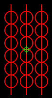|||
|01572|低压站内电抗器||||	
|01573|低压站内测量仪表||||	
|01574|低压站内计量仪表||||	
|015741010|实表位@A相||||
|015741020|实表位@B相||||
|015741030|实表位@C相||||
|015741040|实表位@ABC三相||||
|015742010|空表位@A相||||
|015742020|空表位@B相||||
|015742030|空表位@C相||||
|015742040|空表位@ABC三相||||
|01575|低压站内电缆终端头|||未配置|
|01582|低压站内电压互感器端子|||未配置|
|01590|低压站内低压柜||||
|01597|低压站内双端电缆终端头|||未配置|

#电网公共
|序号|名称|图元示例|规格说明|备注|
|:---|:---|:---:|---|---|
|02810|电缆沟||||
|0281910|隧道||| 3p|
|0281920|沟槽||| 3p|
|0281930|管道||| 3p|
|0281940|桥架||| 3p|
|0281950|架空||| 3p|
|0281960|直埋||| 3p|
|02820|电缆井||||
|0282010|操作井||||
|0282020|转弯井||||
|0282030|接头井||||
|0282040|终端井||||
|0282050|虚拟井||||
|02821|营业厅||||
|02850|电缆井电缆悬挂点|||未配置|	
|02880|接地符|||未配置|	
|01880|站内接地符|||未配置|	

